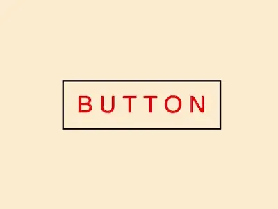

+++
title = '按钮文字滑动特效'
date = 2018-04-23T19:01:50+08:00
summary = '#1'
categories = ['开发实战']
subtitle = '开发实战 第1号作品'
image = '/fe/img/thumbs/001.png'
+++



## 效果预览

点击链接可以在 Codepen 预览。

[https://codepen.io/zhang-ou/pen/GdpPLE](https://codepen.io/zhang-ou/pen/GdpPLE)

## 可交互视频

此视频是可以交互的，你可以随时暂停视频，编辑视频中的代码。

[https://scrimba.com/c/c4vdvcL](https://scrimba.com/c/c4vdvcL)

## 源代码下载

请从 github 下载。

[https://github.com/comehope/front-end-daily-challenges/tree/master/001-button-text-staggered-sliding-effects](https://github.com/comehope/front-end-daily-challenges/tree/master/001-button-text-staggered-sliding-effects)

## 代码解读

定义 dom，在一个容器中定义按钮的文字，每个字母一个 span，每个 span 有一个 data-text 属性，其值与 span 内的字母相同：
```html
<div class="box">
    <span data-text="B">B</span>
    <span data-text="U">U</span>
    <span data-text="T">T</span>
    <span data-text="T">T</span>
    <span data-text="O">O</span>
    <span data-text="N">N</span>
</div>
```

按钮居中：
```css
html, body {
    height: 100%;
    display: flex;
    align-items: center;
    justify-content: center;
}
```

设置按钮的尺寸和文字样式：
```css
.box {
    width: 200px;
    height: 60px;
    border: 2px solid black;
    text-align: center;
    font-size: 30px;
    line-height: 60px;
    font-family: sans-serif;
}
```

按钮的每个字母都设置为行内块元素，以便单独设置动效：
```css
.box span {
    display: inline-block;
    color: blue;
}
```

把字母交错地显示在按钮容器之外，第奇数个元素显示在上，第偶数个元素显示在下：
```css
.box span:nth-child(odd) {
    transform: translateY(-100%);
}

.box span:nth-child(even) {
    transform: translateY(100%);
}
```

用伪元素为每个字母增加一个副本：
```css
.box span::before {
    content: attr(data-text);
    position: absolute;
    color: red;
}
```

让伪元素的字母也交错显示，位置与其原始元素相对：
```css
.box span:nth-child(odd)::before {
    transform: translateY(100%);
}

.box span:nth-child(even)::before {
    transform: translateY(-100%);
}
```

为按钮增加鼠标划过样式，设置緩动时间，使其有动画效果：
```css
.box:hover span {
    transform: translateY(0);
}

.box span {
    transition: 0.5s;
}
```

最后，隐藏容器外的内容：
```css
.box {
    overflow: hidden;
}
```

大功告成！

## 知识点

* [::before](https://developer.mozilla.org/en-US/docs/Web/CSS/::before)

* [translateY](https://developer.mozilla.org/en-US/docs/Web/CSS/transform-function/translateY)

* [data-*](https://developer.mozilla.org/en-US/docs/Web/HTML/Global_attributes/data-%2A)

* [content](https://developer.mozilla.org/en-US/docs/Web/CSS/content)

* [nth-child](https://developer.mozilla.org/en-US/docs/Web/CSS/:nth-child)
