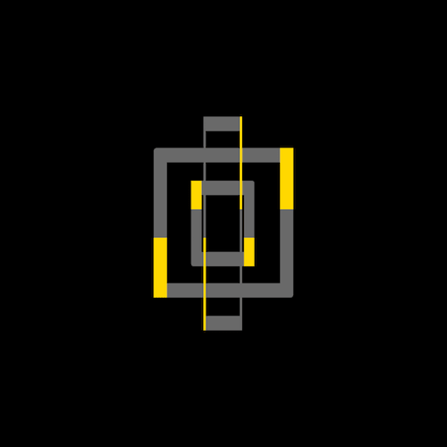

+++
title = '矩形旋转 loading 特效'
date = 2018-04-24T12:14:21+08:00
image = '/fe/img/thumbs/002.png'
summary = '#2'
+++



## 效果预览

点击链接可以在 Codepen 预览。

[https://codepen.io/zhang-ou/pen/vjLQMM](https://codepen.io/zhang-ou/pen/vjLQMM)

## 可交互视频教程

此视频是可以交互的，你可以随时暂停视频，编辑视频中的代码。

[https://scrimba.com/c/cJMkwH9](https://scrimba.com/c/cJMkwH9)

## 源代码下载

请从 github 下载。

[https://github.com/comehope/front-end-daily-challenges/tree/master/002-rectangular-rotating-loader-animation](https://github.com/comehope/front-end-daily-challenges/tree/master/002-rectangular-rotating-loader-animation)

## 代码解读

定义 dom，一个包含 3 个 span 的容器：
```html
<div class="loader">
	<span></span>
	<span></span>
	<span></span>
</div>
```

居中显示：
```css
html, body {
	height: 100%;
	display: flex;
	align-items: center;
	justify-content: center;
	background-color: black;
}
```

设置容器的尺寸：
```css
.loader {
	width: 150px;
	height: 150px;
	position: relative;
}
```

设置矩形的边框样式：
```css
.loader span {
	position: absolute;
	box-sizing: border-box;
	border: 10px solid dimgray;
	border-radius: 2px;
}
```

设置 3 个矩形的尺寸：
```css
.loader span:nth-child(1) {
	width: 100%;
	height: 100%;
}

.loader span:nth-child(2) {
	width: 70%;
	height: 70%;
	margin: 15%;
}

.loader span:nth-child(3) {
	width: 40%;
	height: 40%;
	margin: 30%;
}
```

用伪元素绘制左上和右下的装饰条：
```css
.loader span::before,
.loader span::after {
	content: '';
	position: absolute;
	width: 10px;
	height: 50%;
	background-color: gold;
}

.loader span::before {
	top: -10px;
	left: -10px;
}

.loader span::after {
	bottom: -10px;
	right: -10px;
}
```

定义动画效果：
```css
@keyframes rotating {
	from {
		transform: rotateY(0deg);
	}

	to {
		transform: rotateY(360deg);
	}
}
```

把动画应用到 3 个矩形上：
```css
.loader span {
	animation: rotating linear infinite;
}

.loader span:nth-child(1) {
	animation-duration: 4s;
}

.loader span:nth-child(2) {
	animation-duration: 2s;
}

.loader span:nth-child(3) {
	animation-duration: 1s;
}
```

最后，设置一下 3 个矩形的堆叠顺序：
```css
.loader span:nth-child(1) {
	z-index: 3;
}

.loader span:nth-child(2) {
	z-index: 2;
}

.loader span:nth-child(3) {
	z-index: 1;
}
```

大功告成！
