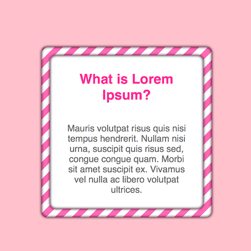

+++
title = '容器厚条纹边框特效'
date = 2018-04-25T12:19:34+08:00
image = '/test-hugo-deploy/img/thumbs/003.png'
summary = '#3'
+++



## 效果预览

点击链接可以在 Codepen 预览。

[https://codepen.io/zhang-ou/pen/YLqbXy](https://codepen.io/zhang-ou/pen/YLqbXy)

## 可交互视频教程

此视频是可以交互的，你可以随时暂停视频，编辑视频中的代码。

[https://scrimba.com/c/cPvn6tE](https://scrimba.com/c/cPvn6tE)

## 源代码下载

请从 github 下载。

[https://github.com/comehope/front-end-daily-challenges/tree/master/003-diagonal-stripe-border-effects](https://github.com/comehope/front-end-daily-challenges/tree/master/003-diagonal-stripe-border-effects)

## 代码解读

定义一个名为 box 的容器：
```html
<div class="box">
</div>
```

内容居中显示：
```css
html,
body {
	height: 100%;
	display: flex;
	align-items: center;
	justify-content: center;
}
```

画条纹背景：
```css
.box {
	width: 300px;
	height: 300px;
	background: linear-gradient(
		-45deg,
		white 0%,
		white 25%,
		hotpink 25%,
		hotpink 50%,
		white 50%,
		white 75%,
		hotpink 75%,
		hotpink 100%);
	background-size: 10%;
}
```

在 box 容器内定义一个名为 content 的容器：
```html
<div class="box">
	<div class="content">
	</div>
</div>
```

box 容器留出厚边框，content 容器嵌在其中：
```css
.box .content {
	height: 100%;
	display: flex;
	align-items: center;
	justify-content: center;
}

.box {
	box-sizing: border-box;
	padding: 15px;
}

.box .content {
	background-color: white;
}
```

设置厚边框的立体效果：
```css
.box,
.box .content {
	box-shadow: 0 0 2px deeppink,
				0 0 5px rgba(0, 0, 0, 1),
				inset 0 0 5px rgba(0, 0, 0, 1);
	border-radius: 10px;
}
```

content 容器中增加内容：
```html
<div class="box">
	<div class="content">
		<h2>What is Lorem Ipsum?</h2>
		<p>Mauris volutpat risus quis nisi tempus hendrerit. Nullam nisi urna, suscipit quis risus sed, congue congue quam. Morbi sit amet suscipit ex. Vivamus vel nulla ac libero volutpat ultrices.</p>
	</div>
</div>
```

内容布局：
```css
.box .content {
	flex-direction: column;
	box-sizing: border-box;
	padding: 30px;
	text-align: center;
	font-family: sans-serif;
}

.box .content h2 {
	color: deeppink;
}

.box .content p {
	color: dimgray;
}
```

定义动画效果：
```css
@keyframes animate {
	from {
		background-position: 0;
	}

	to {
		background-position: 10%;
	}
}
```

最后，把动画效果应用到 box 容器上：
```css
.box {
	animation: animate 2s linear infinite;
}
```

大功告成！
