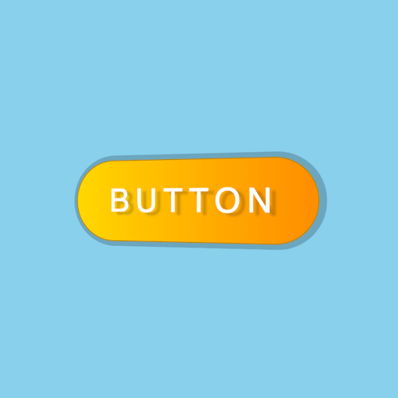

+++
title = '金属光泽 3D 按钮特效'
date = 2018-04-26T12:21:56+08:00
image = '/fe/img/thumbs/004.png'
summary = '#4'
+++



## 效果预览

点击链接可以在 Codepen 预览。

[https://codepen.io/zhang-ou/full/MGeRRO](https://codepen.io/zhang-ou/full/MGeRRO)

## 可交互视频教程

此视频是可以交互的，你可以随时暂停视频，编辑视频中的代码。

[https://scrimba.com/c/cdKMBTk](https://scrimba.com/c/cdKMBTk)

## 源代码下载

请从 github 下载。

[https://github.com/comehope/front-end-daily-challenges/tree/master/004-metallic-glossy-3d-button-effects](https://github.com/comehope/front-end-daily-challenges/tree/master/004-metallic-glossy-3d-button-effects)

## 代码解读

在 dom 中定义一个容器：
```html
<div class="box">BUTTON</div>
```

容器居中显示：
```css
html, body {
	height: 100%;
	display: flex;
	align-items: center;
	justify-content: center;
	background-color: skyblue;
}
```

设置按钮的 2d 样式，为了便于调整按钮尺寸，使用了变量：
```css
.box {
	background: linear-gradient(to right, gold, darkorange);
	color: white;
	--width: 250px;
	--height: calc(var(--width) / 3);
	width: var(--width);
	height: var(--height);
	text-align: center;
	line-height: var(--height);
	font-size: calc(var(--height) / 2.5);
	font-family: sans-serif;
	letter-spacing: 0.2em;
	border: 1px solid darkgoldenrod;
	border-radius: 2em;
}
```

设置按钮的 3d 样式：
```css
.box {
	transform: perspective(500px) rotateY(-15deg);
	text-shadow: 6px 3px 2px rgba(0, 0, 0, 0.2);
	box-shadow: 2px 0 0 5px rgba(0, 0, 0, 0.2);
}
```

定义按钮的鼠标划过动画效果：
```css
.box:hover {
	transform: perspective(500px) rotateY(15deg);
	text-shadow: -6px 3px 2px rgba(0, 0, 0, 0.2);
	box-shadow: -2px 0 0 5px rgba(0, 0, 0, 0.2);
}

.box {
	transition: 0.5s;
}
```css

用伪元素增加光泽：
```css
.box {
	position: relative;
}

.box::before {
	content: '';
	position: absolute;
	width: 100%;
	height: 100%;
	background: linear-gradient(to right, transparent, white, transparent);
	left: 0;
}
```

定义光泽动画效果：
```css
.box::before {
	left: -100%;
	transition: 0.5s;
}

.box:hover::before {
	left: 100%;
}
```

最后，隐藏容器之外的内容：
```css
.box {
	overflow: hidden;
}
```

大功告成！
