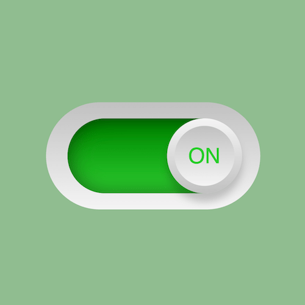

+++
title = '立体滑动 Toggle 控件'
date = 2018-04-27T12:38:35+08:00
image = '/test-hugo-deploy/img/thumbs/005.png'
summary = '#5'
+++



## 效果预览

点击链接可以在 Codepen 预览。

[https://codepen.io/zhang-ou/pen/zjoOgX](https://codepen.io/zhang-ou/pen/zjoOgX)

## 可交互视频教程

此视频是可以交互的，你可以随时暂停视频，编辑视频中的代码。

[https://scrimba.com/c/cPvMzTg](https://scrimba.com/c/cPvMzTg)

## 源代码下载

请从 github 下载。

[https://github.com/comehope/front-end-daily-challenges/tree/master/005-sleek-sliding-toggle-checkbox](https://github.com/comehope/front-end-daily-challenges/tree/master/005-sleek-sliding-toggle-checkbox)

## 代码解读

定义 dom，是嵌套了3层的容器：
```html
<div class="checkbox">
	<div class="inner">
		<div class="toggle"></div>
	</div>
</div>
```

居中显示：
```css
html, 
body,
.checkbox,
.checkbox .inner,
.checkbox .inner .toggle {
	height: 100%;
	display: flex;
	align-items: center;
	justify-content: center;
}
```

画出外侧椭圆：
```css
.checkbox {
	width: 10em;
	height: 5em;
	background: linear-gradient(silver, whitesmoke);
	border-radius: 2.5em;
	font-size: 40px;
}
```

画出内侧椭圆：
```css
.checkbox .inner {
	width: 8em;
	height: 3.5em;
	background: linear-gradient(dimgray, silver);
	border-radius: 2em;
	box-shadow: inset 0 0 1.5em rgba(0, 0, 0, 0.5);
}
```

画出圆形按钮：
```css
.checkbox .inner .toggle {
	width: 3.5em;
	height: 3.5em;
	background: linear-gradient(to top, silver, whitesmoke);
	border-radius: 50%;
	box-shadow: 0 0.4em 0.6em rgba(0, 0, 0, 0.2);
	position: relative;
	left: -30%;
}
```

为圆形按钮增加立体效果：
```css
.checkbox .inner .toggle::before {
	content: '';
	position: absolute;
	height: 80%;
	width: 80%;
	background: linear-gradient(whitesmoke, silver);
	border-radius: 50%;
}
```

在按钮上写上 OFF，行高是根据父元素的高度计算出的：
```css
.checkbox .inner .toggle::before {
	content: 'OFF';
	text-align: center;
	line-height: calc(3.5em * 0.8);
	font-family: sans-serif;
	color: gray;
}
```

引入jquery：
```html
<script src="http://code.jquery.com/jquery-3.3.1.min.js"></script>
```

编写脚本，在点击按钮时切换样式类：
```javascript
$(document).ready(function() {
	$('.toggle').click(function() {
		$('.inner').toggleClass('active');
	});
});
```

设置 active 时控件的样式:
```css
.checkbox .inner.active {
	background: linear-gradient(green, limegreen);
}

.checkbox .inner.active .toggle {
	left: 30%;
}

.checkbox .inner.active .toggle::before {
	content: 'ON';
	color: limegreen;
}
```

最后，为按钮设置缓动时间，实现动画效果
```css
.checkbox .inner .toggle {
	transition: 0.5s;
}
```

大功告成！
