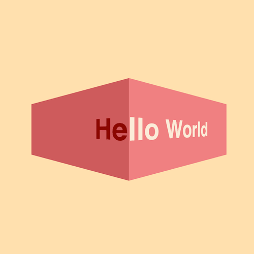

+++
title = '3D 文字跑马灯特效'
date = 2018-04-29T12:47:46+08:00
image = '/fe/img/thumbs/007.png'
summary = '#7'
+++



## 效果预览

点击链接可以在 Codepen 预览。

[https://codepen.io/zhang-ou/pen/GdrrZq](https://codepen.io/zhang-ou/pen/GdrrZq)

## 可交互视频教程

此视频是可以交互的，你可以随时暂停视频，编辑视频中的代码。

[https://scrimba.com/c/cWknNUR](https://scrimba.com/c/cWknNUR)

## 源代码下载

请从 github 下载。

[https://github.com/comehope/front-end-daily-challenges/tree/master/007-3d-text-marquee-effects](https://github.com/comehope/front-end-daily-challenges/tree/master/007-3d-text-marquee-effects)

## 代码解读

定义 dom，包含2组重复的文字：
```html
<div class="box">
	<div class="inner">
		<span>Hello World</span>
	</div>
	<div class="inner">
		<span>Hello World</span>
	</div>
</div>
```

居中显示：
```css
html,
body {
	height: 100%;
	display: flex;
	align-items: center;
	justify-content: center;
}
```

设置容器的尺寸和文字样式：
```css
.box {
	display: flex;
}

.box .inner {
	width: 200px;
	height: 100px;
	line-height: 100px;
	font-size: 32px;
	font-family: sans-serif;
	font-weight: bold;
	white-space: nowrap;
}
```

配色：
```css
.box .inner:first-child {
	background-color: indianred;
	color: darkred;
}

.box .inner:last-child {
	background-color: lightcoral;
	color: antiquewhite;
}
```

设置 3d 效果：
```css
.box .inner:first-child {
	transform-origin: left;
	transform: perspective(300px) rotateY(-67.3deg);
}

.box .inner:last-child {
	transform-origin: right;
	transform: perspective(300px) rotateY(67.3deg);
}
```

定义动画效果：
```css
@keyframes marquee {
	from {
		left: 100%;
	}

	to {
		left: -100%;
	}
}
```

把动画效果应用到文字上，并隐藏容器外的内容：
```css
.box .inner span {
	position: absolute;
	animation: marquee 5s linear infinite;
}

.box .inner {
	overflow: hidden;
}
```

让左侧的文字延迟运动，模拟出2组文字连贯运动的效果：
```css
.box .inner:first-child span {
	animation-delay: 2.5s;
	left: -100%;
}
```

大功告成！
