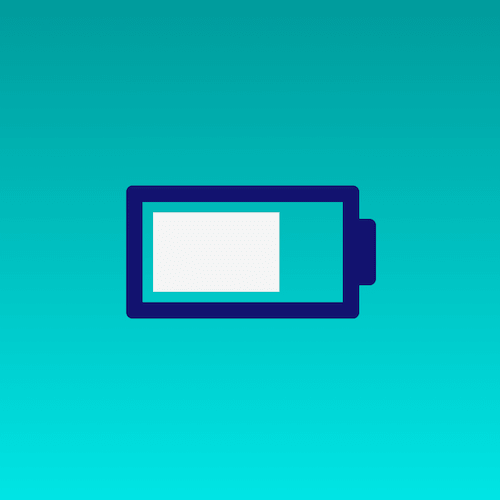

+++
title = '充电 loading 特效'
date = 2018-04-30T12:51:19+08:00
image = '/test-hugo-deploy/img/thumbs/008.png'
summary = '#8'
+++



## 效果预览

点击链接可以在 Codepen 预览。

[https://codepen.io/zhang-ou/pen/deNqdV](https://codepen.io/zhang-ou/pen/deNqdV)

## 可交互视频教程

此视频是可以交互的，你可以随时暂停视频，编辑视频中的代码。

[https://scrimba.com/c/cvrwJAK](https://scrimba.com/c/cvrwJAK)

## 源代码下载

请从 github 下载。

[https://github.com/comehope/front-end-daily-challenges/tree/master/008-charging-loader-animation](https://github.com/comehope/front-end-daily-challenges/tree/master/008-charging-loader-animation)

## 代码解读

定义 dom，只有一个容器元素：
```html
<div class="battery"></div>
```

居中显示：
```css
html, body {
	height: 100%;
	display: flex;
	align-items: center;
	justify-content: center;
	background: linear-gradient(to bottom, teal, aqua);
}
```

画出电池的主体轮廓：
```css
.battery {
	width: 6em;
	height: 3em;
	color: midnightblue;
	border: 0.5em solid currentColor;
	border-radius: 0.2em;
	font-size: 2em;
}
```

画出电池的突起：
```css
.battery {
	position: relative;
}

.battery::after {
	content: '';
	position: absolute;
	width: 0.5em;
	height: 2em;
	background-color: currentColor;
	top: 0.5em;
	right: -1em;
	border-radius: 0 0.2em 0.2em 0;
}
```

画出充电电量：
```css
.battery {
	background-image: linear-gradient(to right, whitesmoke, whitesmoke);
	background-repeat: no-repeat;
	background-size: 30% 80%;
	background-position: 0.3em 50%;
}
```

定义和应用动画效果：
```css
@keyframes charge {
	from {
		background-size: 10% 80%;
	}

	to {
		background-size: 95% 80%;
	}
}

.battery {
	animation: charge 5s linear infinite;
}
```

最后，把动画的时间函数由线性变化改为步长变化：
```css
.battery {
	animation: charge 5s steps(8) infinite;
}
```

大功告成！
