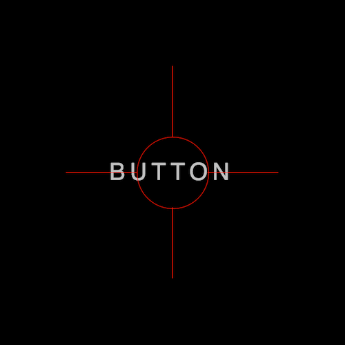

+++
title = '按钮被瞄准特效'
date = 2018-05-01T15:09:14+08:00
image = '/fe/img/thumbs/009.png'
summary = '#9'
+++



## 效果预览

点击链接可以在 Codepen 预览。

[https://codepen.io/zhang-ou/pen/ELWMLr](https://codepen.io/zhang-ou/pen/ELWMLr)

## 可交互视频教程

此视频是可以交互的，你可以随时暂停视频，编辑视频中的代码。

[https://scrimba.com/c/cqrNEsm](https://scrimba.com/c/cqrNEsm)

## 源代码下载

请从 github 下载。

[https://github.com/comehope/front-end-daily-challenges/tree/master/009-aimed-button-effects](https://github.com/comehope/front-end-daily-challenges/tree/master/009-aimed-button-effects)

## 代码解读

定义 dom，容器中包含 5 个 span，第 1 个是按钮文字，另 4 个用来修饰：
```html
<div class="box">
	<span>BUTTON</span>
	<span class="top"></span>
	<span class="bottom"></span>
	<span class="left"></span>
	<span class="right"></span>
</a>
```

居中显示：
```css
html, body {
	height: 100%;
	display: flex;
	align-items: center;
	justify-content: center;
	background-color: black;
	color: silver;
}
```

设置文字样式：
```css
.box {
	width: 9em;
	height: 3em;
	font-size: 30px;
	text-align: center;
	line-height: 3em;
	letter-spacing: 0.2em;
	font-family: sans-serif;
}
```

画出瞄准镜中间的圆圈：
```css
.box {
	position: relative;
}

.box::after {
	content: '';
	position: absolute;
	width: 3em;
	height: 3em;
	border: 1px solid red;
	border-radius: 50%;
	left: 3em;
}
```

画出瞄准镜的十字坐标线：
```css
.box span:not(:first-child) {
	position: absolute;
	background-color: red;
}

.box span.top,
.box span.bottom {
	width: 1px;
	height: 3em;
	left: 50%;
}

.box span.top {
	top: -3em;
}

.box span.bottom {
	bottom: -3em;
}

.box span.left,
.box span.right {
	width: 3em;
	height: 1px;
	top: 50%;
}

.box span.left {
	left: 0;
}

.box span.right {
	right: 0;
}
```


定义瞄准动画：
```css
@keyframes aim {
	from {
		filter: opacity(0.2);
	}

	to {
		filter: opacity(0.8);
	}
}
```

应用瞄准动画到瞄准镜上：
```css
.box::after {
	filter: opacity(0);
}

.box span:not(:first-child) {
	filter: opacity(0);
}

.box:hover::after,
.box:hover span:not(:first-child) {
	animation: aim 1s linear infinite alternate;
}
```

最后，为容器设置从模糊到清晰的缓动效果：
```css
.box {
	filter: blur(2px);
	transition: 0.5s;
}

.box:hover {
	filter: blur(0.2px);
}
```

大功告成！
