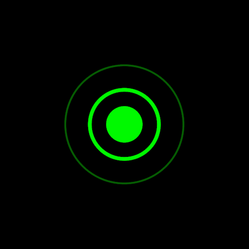

+++
title = '荧光脉冲 loading 特效'
date = 2018-05-03T15:15:17+08:00
image = '/test-hugo-deploy/img/thumbs/011.png'
summary = '#11'
+++



## 效果预览

点击链接可以在 Codepen 预览。

[https://codepen.io/zhang-ou/pen/erRzzR](https://codepen.io/zhang-ou/pen/erRzzR)

## 可交互视频教程

此视频是可以交互的，你可以随时暂停视频，编辑视频中的代码。

[https://scrimba.com/c/cwrJys7](https://scrimba.com/c/cwrJys7)

## 源代码下载

请从 github 下载。

[https://github.com/comehope/front-end-daily-challenges/tree/master/011-ripple-pulse-loader-animation](https://github.com/comehope/front-end-daily-challenges/tree/master/011-ripple-pulse-loader-animation)

## 代码解读

定义 dom，只有一个元素：
```html
<div class="circle"></div>
```

居中显示：
```css
html,
body,
.circle {
	height: 100%;
	display: flex;
	align-items: center;
	justify-content: center;
	background-color: black;
}
```

画出中间的实心圆：
```css
.circle {
	width: calc(var(--innerRadius) * 2);
	height: calc(var(--innerRadius) * 2);
	background-color: lime;
	border-radius: 50%;
}
```

画出圆环：
```css
.circle {
	box-shadow: 0 0 0 calc(var(--innerRadius) - 0.4em) black,
				0 0 0 var(--innerRadius) lime;
}
```

用伪元素 ::before 画出动画用到的圆环：
```css
.circle::before {
	content: '';
	position: absolute;
	width: calc(var(--innerRadius) * 2 * 2);
	height: calc(var(--innerRadius) * 2 * 2);
	border: 2px solid lime;
	border-radius: 50%;
}
```

增加动画效果：
```css
.circle::before
	animation: pulse 2s linear infinite;
}

@keyframes pulse {
	from {
		transform: scale(1);
	}

	to {
		transform: scale(2);
	}
}
```

优化动画——增加渐淡和弹性效果：
```css
.circle::before
	animation: pulse 2s ease-out infinite;
}

@keyframes pulse {
	from {
		filter: opacity(0.9);
	}

	to {
		filter: opacity(0);
	}
}
```

最后，用伪元素 ::after 再画出一个动的圆环：
```css
.circle::after {
	content: '';
	position: absolute;
	width: calc(var(--innerRadius) * 2 * 2);
	height: calc(var(--innerRadius) * 2 * 2);
	border: 2px solid lime;
	border-radius: 50%;
	animation: pulse 2s ease-out infinite;
}

.circle::after {
	animation-delay: 1s;
}
```

大功告成！
