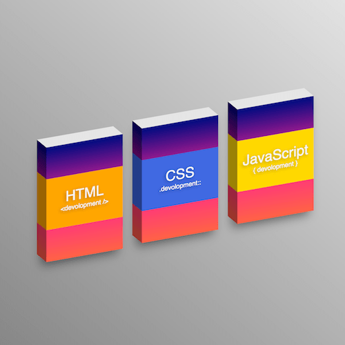

+++
title = '侧立的图书'
date = 2018-05-07T15:23:49+08:00
image = '/test-hugo-deploy/img/thumbs/014.png'
summary = '#14'
+++



## 效果预览

点击链接可以在 Codepen 预览。

[https://codepen.io/zhang-ou/pen/deVgRM](https://codepen.io/zhang-ou/pen/deVgRM)

## 可交互视频教程

此视频是可以交互的，你可以随时暂停视频，编辑视频中的代码。

[https://scrimba.com/c/cb6pkUE](https://scrimba.com/c/cb6pkUE)

## 源代码下载

请从 github 下载。

[https://github.com/comehope/front-end-daily-challenges/tree/master/014-three-languages-for-web-development](https://github.com/comehope/front-end-daily-challenges/tree/master/014-three-languages-for-web-development)

## 代码解读

定义 dom，一个容器中包含一个 span，span 内有文字：
```html
<div class="book">
	<span>HTML</span>
</div>
```

居中显示：
```css
html, body {
	width: 100%;
	height: 100%;
	display: flex;
	align-items: center;
	justify-content: center;
	background: linear-gradient(to top left, white, dimgray);
}
```

画出书的正面：
```css
.book {
	width: 12rem;
	height: 18rem;
	background: linear-gradient(navy, deeppink, tomato);
	transform: skewY(-10deg);
}
```

画出书的侧面：
```css
.book {
	position: relative;
}

.book::before {
	content: '';
	position: absolute;
	width: 1.5rem;
	height: 100%;
	background: linear-gradient(navy, deeppink, tomato);
	top: 0;
	left: -1.5rem;
	transform: skewY(45deg);
	transform-origin: right;
	filter: brightness(0.6);
}
```

画出书的顶面：
```css
.book::after {
	content: '';
	position: absolute;
	width: 100%;
	height: 1.5rem;
	background: white;
	top: -1.5rem;
	left: 0;
	transform-origin: bottom;
	transform: skewX(45deg);
	filter: brightness(0.9);
}
```

给图书加阴影，让它显得更立体：
```css
.book {
	box-shadow: -10px 5px 30px rgba(0, 0, 0, 0.5);
}
```

设置文字样式：
```css
.book span {
	color: whitesmoke;
	font-size: 2.2rem;
	font-family: sans-serif;
	display: block;
	background: silver;
	text-align: center;
	height: 8rem;
	margin-top: 5rem;
	padding-top: 2rem;
	box-sizing: border-box;
	text-shadow: -2px 2px 10px rgba(0, 0, 0, 0.3);
	position: absolute;
	width: 100%;
}
```

画出文字侧面，与画图书侧面的方法相似：
```css
.book span {
	position: relative;
}

.book span::before {
	content: '';
	position: absolute;
	width: 1.5rem;
	height: 100%;
	background: silver;
	top: 0;
	left: -1.5rem;
	transform-origin: right;
	transform: skewY(45deg);
	filter: brightness(0.6);
}
```

文字下增加一行小字号文字：
```css
.book span::after {
	content: 'development';
	display: block;
	font-size: 1rem;
}
```

dom 改为 3 本书，包含在一个容器之中，并且分别命名样式类：
```html
<div class="books">
	<div class="book html">
		<span>HTML</span>
	</div>
	<div class="book css">
		<span>CSS</span>
	</div>
	<div class="book js">
		<span>JavaScript</span>
	</div>
</div>
```

3 本书布局：
```dom
.books {
	display: flex;
	width: calc(12rem * 3 + 3rem * 2);
	justify-content: space-between;
	margin-top: 6rem;
}

.book:nth-child(2) {
	top: -3rem;
}

.book:nth-child(3) {
	top: -6rem;
}
```

3 本书配色：
```css
.book.html span,
.book.html span::before {
	background: orange;
}

.book.css span,
.book.css span::before {
	background: yellowgreen;
}

.book.js span,
.book.js span::before {
	background: royalblue;
}
```

设置 3 本书的小字号文字：
```css
.book.html span:after {
	content: '<devolopment />';
}

.book.css span::after {
	content: '.devolopment::';
}

.book.js span::after {
	content: '{ devolopment }';
}
```

最后，为图书增加鼠标划过效果：
```css
.book {
	transition: 0.3s;
}

.book:hover {
	margin-top: -1.5rem;
}
```

大功告成！
