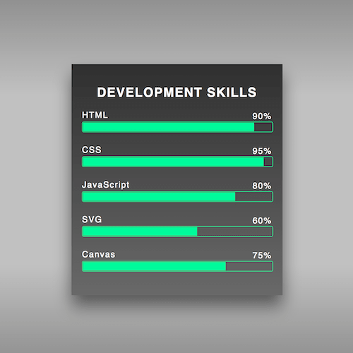

+++
title = '技能卡片'
date = 2018-05-08T15:27:05+08:00
image = '/fe/img/thumbs/015.png'
summary = '#15'
+++



## 效果预览

点击链接可以在 Codepen 预览。

[https://codepen.io/zhang-ou/pen/XqzGLp](https://codepen.io/zhang-ou/pen/XqzGLp)

## 可交互视频教程

此视频是可以交互的，你可以随时暂停视频，编辑视频中的代码。

[https://scrimba.com/c/cJdEgc9](https://scrimba.com/c/cJdEgc9)

## 源代码下载

请从 github 下载。

[https://github.com/comehope/front-end-daily-challenges/tree/master/015-development-skills-card](https://github.com/comehope/front-end-daily-challenges/tree/master/015-development-skills-card)

## 代码解读

定义 dom，最外层的容器是卡片，内含一个标题，和一个技能说明，分别描述技能的名称和级别：
```html
<div class="card">
	<h2>Development Skills</h2>
	<p class="skill html">
		<span>HTML5</span>
		<span class="level">90%</span>
	</p>
</div>
```

居中显示：
```css
html, body {
	height: 100%;
	display: flex;
	align-items: center;
	justify-content: center;
	background: linear-gradient(dimgray, silver, silver, dimgray);
}
```

技能卡片布局：
```
.card {
	width: 400px;
	background: linear-gradient(#333, dimgray);
	box-sizing: border-box;
	padding: 20px;
	font-family: sans-serif;
	color: white;
	letter-spacing: 0.1em;
	box-shadow: 0 20px 50px rgba(0, 0, 0, 0.5);
}
```

文字布局：
```css
.card h2 {
	text-transform: uppercase;
	text-align: center;
}

.card .skill {
	height: 50px;
}

.card .skill span {
	display: block;
}

.card .skill .level {
	transform: translateY(-1em);
	text-align: right;
}
```

用伪元素画出条形图：
```css
.card .skill .level {
	position: relative;
}

.card .skill .level::before,
.card .skill .level::after {
	content: '';
	position: absolute;
	top: 1.2em;
	left: 0;
	width: 100%;
	height: 100%;
}

.card .skill .level::before {
	border: 1px solid mediumspringgreen;
	border-radius: 0.2em;
	height: 105%;
}

.card .skill .level::after {
	background-image: linear-gradient(to right, mediumspringgreen, mediumspringgreen);
	background-repeat: no-repeat;
	background-position: top 0.1em left 0.1em;
}
```

设置条形图的填充比例：
```css
.card .skill.html .level::after {
	background-size: 90% 1em;
}
```

dom 增加多个技能，每个技能用命名不同的样式类：
```html
<div class="card">
	<h2>Development Skills</h2>
	<p class="skill html">
		<span>HTML</span>
		<span class="level">90%</span>
	</p>
	<p class="skill css">
		<span>CSS</span>
		<span class="level">95%</span>
	</p>
	<p class="skill javascript">
		<span>JavaScript</span>
		<span class="level">80%</span>
	</p>
	<p class="skill svg">
		<span>SVG</span>
		<span class="level">60%</span>
	</p>
	<p class="skill canvas">
		<span>Canvas</span>
		<span class="level">75%</span>
	</p>
</div>
```

分别定义每个技能的条形图宽度：
```css
.card .skill.css .level::after {
	background-size: 95% 1em;
}

.card .skill.js .level::after {
	background-size: 80% 1em;
}

.card .skill.svg .level::after {
	background-size: 60% 1em;
}

.card .skill.vue .level::after {
	background-size: 75% 1em;
}
```

最后，增加一点交互效果：
```css
.card .skill:hover {
	background-color: #333;
}
```

大功告成！
