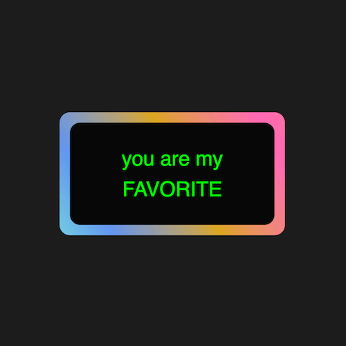

+++
title = '渐变色动画边框'
date = 2018-05-09T15:29:28+08:00
image = '/test-hugo-deploy/img/thumbs/016.png'
summary = '#16'
+++



## 效果预览

点击链接可以在 Codepen 预览。

[https://codepen.io/comehope/pen/odpRKX](https://codepen.io/comehope/pen/odpRKX)

## 可交互视频教程

请用 chrome, safari, edge 打开观看。

[https://scrimba.com/c/cmQV7Hd](https://scrimba.com/c/cmQV7Hd)

## 源代码下载

请从 github 下载。

[https://github.com/comehope/front-end-daily-challenges/tree/master/016-colorful-gradient-animated-border](https://github.com/comehope/front-end-daily-challenges/tree/master/016-colorful-gradient-animated-border)

## 代码解读

定义 dom，一个容器中包含一些文字：
```html
<div class="box">
	you are my<br>
	FAVORITE
</div>
```

居中显示：
```css
html,
body,
.box {
	height: 100%;
	display: flex;
	align-items: center;
	justify-content: center;
}
```

设置页面背景色：
```css
body {
	background: #222;
}
```

设置容器和文字样式：
```css
.box {
	color: white;
	font-size: 2.5em;
	width: 10em;
	height: 5em;
	background: #111;
	font-family: sans-serif;
	line-height: 1.5em;
	text-align: center;
	border-radius: 0.2em;
}
```

用伪元素增加一个背板：
```css
.box {
	position: relative;
}

.box::after {
	content: '';
	position: absolute;
	width: 102%;
	height: 104%;
	background-color: orange;
	z-index: -1;
	border-radius: 0.2em;
}
```

把背板设置为渐变色的：
```css
.box::after {
	/*background-color: orange;*/
	background-image: linear-gradient(60deg, aquamarine, cornflowerblue, goldenrod, hotpink, salmon, lightgreen, sandybrown, violet);
}
```

为背板设置动画效果：
```css
.box::after {
	background-size: 300%, 300%;
	animation: animate_bg 5s ease infinite alternate;
}

@keyframes animate_bg {
	0% {
		background-position: 0%, 50%;
	}

	50% {
		background-position: 100%, 50%;
	}

	100% {
		background-position: 0%, 50%;
	}
}
```

最后，再为文字增加变色效果：
```css
.box {
	animation: animate_text 2s linear infinite alternate;
}

@keyframes animate_text {
	from {
		color: lime;
	}

	to {
		color: yellow;
	}
}
```

大功告成！
