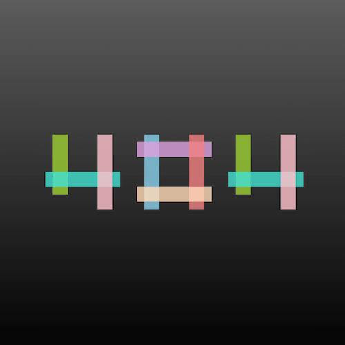

+++
title = '笔划可变形的 404 特效'
date = 2018-05-11T15:38:38+08:00
image = '/fe/img/thumbs/018.png'
summary = '#18'
+++



## 效果预览

点击链接可以在 Codepen 预览。

[https://codepen.io/comehope/pen/ZoxjXm](https://codepen.io/comehope/pen/ZoxjXm)

## 可交互视频教程

此视频是可以交互的，你可以随时暂停视频，编辑视频中的代码。

[https://scrimba.com/p/pEgDAM/cmQwKAa](https://scrimba.com/p/pEgDAM/cmQwKAa)

## 源代码下载

请从 github 下载。

[https://github.com/comehope/front-end-daily-challenges/tree/master/018-stroke-morphing-404-effects](https://github.com/comehope/front-end-daily-challenges/tree/master/018-stroke-morphing-404-effects)

## 代码解读

定义 dom，容器中包含 3 个 <p>，每个 <p> 代表 1 个数字；每个 p 标签包含若干 <span>，每个 <span> 代表 1 个笔划：
```html
<section class="four-zero-four">
	<p class="four">
		<span></span>
		<span></span>
		<span></span>
	</p>
	<p class="zero">
		<span></span>
		<span></span>
		<span></span>
		<span></span>
	</p>
	<p class="four">
		<span></span>
		<span></span>
		<span></span>
	</p>
</section>
```

居中显示：
```css
html, body {
	height: 100%;
	display: flex;
	align-items: center;
	justify-content: center;
	background: linear-gradient(gray, silver);
}
```

整体布局：
```css
.four-zero-four p {
	width: 10em;
	height: 10em;
	border: 1px dashed white;
	display: inline-block;
	margin: 1em;
	position: relative;
}
```

设置笔划共有属性：
```css
.four-zero-four p span {
	position: absolute;
	box-sizing: border-box;
	filter: opacity(0.8);
}
```

画出数字 4 的笔划：
```css
.four span:nth-child(1) {
	width: 20%;
	height: 80%;
	left: 10%;
}

.four span:nth-child(2) {
	width: 100%;
	height: 20%;
	bottom: 30%;
}

.four span:nth-child(3) {
	width: 20%;
	height: 100%;
	right: 10%;
}
```

画出数字 0 的笔划：
```css
.zero span:nth-child(1) {
	width: 20%;
	height: 100%;
	left: 10%;
}

.zero span:nth-child(2) {
	width: 100%;
	height: 20%;
	top: 10%;
}

.zero span:nth-child(3) {
	width: 20%;
	height: 100%;
	right: 10%;
}

.zero span:nth-child(4) {
	width: 100%;
	height: 20%;
	bottom: 10%;
}
```

给笔划上色：
```css
.four span:nth-child(1) {
	background-color: yellowgreen;
}

.four span:nth-child(2) {
	background-color: turquoise;
}

.four span:nth-child(3) {
	background-color: pink;
}

.zero span:nth-child(1) {
	background-color: skyblue;
}

.zero span:nth-child(2) {
	background-color: plum;
}

.zero span:nth-child(3) {
	background-color: lightcoral;
}

.zero span:nth-child(4) {
	background-color: peachpuff;
}
```

设置划过数字时笔划的变化效果：
```css
.four-zero-four p:hover span {
	border: 1px solid black;
	background-color: transparent;
	filter: opacity(1);
	transition: 0.3s;
}
```

设置划过数字时笔划的偏移量：
```css
.four:hover span:nth-child(1) {
	left: 0;
}

.four:hover span:nth-child(2) {
	bottom: 0;
}

.four:hover span:nth-child(3) {
	right: 0;
}

.zero:hover span:nth-child(1) {
	left: 0;
}

.zero:hover span:nth-child(2) {
	top: 0;
}

.zero:hover span:nth-child(3) {
	right: 0;
}

.zero:hover span:nth-child(4) {
	bottom: 0;
}
```

最后，设置缓动时长：
```css
.four-zero-four p span {
	transition: 0.3s;
}

.four-zero-four p:hover span {
	transition: 0.3s;
}
```

大功告成！
