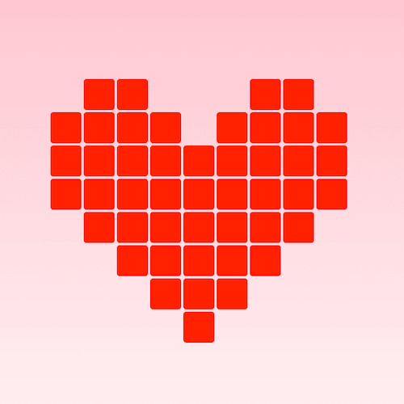

+++
title = '像素画红心动画'
date = 2018-05-13T15:41:33+08:00
image = '/fe/img/thumbs/020.png'
summary = '#20'
+++



## 效果预览

点击链接可以在 Codepen 预览。

[https://codepen.io/comehope/pen/LmrZVX](https://codepen.io/comehope/pen/LmrZVX)

## 可交互视频教程

此视频是可以交互的，你可以随时暂停视频，编辑视频中的代码。

[https://scrimba.com/p/pEgDAM/cPd9asV](https://scrimba.com/p/pEgDAM/cPd9asV)

## 代码解读

定义 dom，描绘出 8 行 9 列的心形像素图案，其中 <dot> 是指要填充颜色的像素点：
```html
<div class="heart">
	<!-- line 1 -->
	<span></span>
	<dot></dot>
	<dot></dot>
	<span></span>
	<span></span>
	<span></span>
	<dot></dot>
	<dot></dot>
	<span></span>

	<!-- line 2 -->
	<dot></dot>
	<dot></dot>
	<dot></dot>
	<dot></dot>
	<span></span>
	<dot></dot>
	<dot></dot>
	<dot></dot>
	<dot></dot>

	<!-- line 3 -->
	<dot></dot>
	<dot></dot>
	<dot></dot>
	<dot></dot>
	<dot></dot>
	<dot></dot>
	<dot></dot>
	<dot></dot>
	<dot></dot>

	<!-- line 4 -->
	<dot></dot>
	<dot></dot>
	<dot></dot>
	<dot></dot>
	<dot></dot>
	<dot></dot>
	<dot></dot>
	<dot></dot>
	<dot></dot>

	<!-- line 5 -->
	<span></span>
	<dot></dot>
	<dot></dot>
	<dot></dot>
	<dot></dot>
	<dot></dot>
	<dot></dot>
	<dot></dot>
	<span></span>

	<!-- line 6 -->
	<span></span>
	<span></span>
	<dot></dot>
	<dot></dot>
	<dot></dot>
	<dot></dot>
	<dot></dot>
	<span></span>
	<span></span>

	<!-- line 7 -->
	<span></span>
	<span></span>
	<span></span>
	<dot></dot>
	<dot></dot>
	<dot></dot>
	<span></span>
	<span></span>
	<span></span>

	<!-- line 8 -->
	<span></span>
	<span></span>
	<span></span>
	<span></span>
	<dot></dot>
	<span></span>
	<span></span>
	<span></span>
	<span></span>
</div>
```

居中显示：
```css
html,body{
	height: 100%;
	display: flex;
	align-items: center;
	justify-content: center;
	background: linear-gradient(silver, white);
}
```

设置心形的样式：
```css
.heart {
	display: grid;
	grid-template-columns: repeat(9, 1fr);
	grid-gap: 2px;
}

.heart > * {
	width: 1em;
	height: 1em;
	border-radius: 0.1em;
	font-size: 30px;
}

.heart dot{
	background: red;
}
```

定义淡入淡出动画：
```css
.heart dot{
	filter: opacity(0);
	animation: animation 5s ease-out infinite;
}

@keyframes animation{
	0%{
		filter: opacity(0);
		transform: translateY(-10em);
	}

	25%{
		filter: opacity(1);
		transform: translateY(0);
	}

	75%{
		filter: opacity(1);
		transform: translateY(0);
	}

	100%{
		filter: opacity(0);
		transform: translateY(10em);
	}
}
```

最后，让各像素点按不同时间入场，增强动画效果：
```css
.heart dot:nth-of-type(2n) {
	animation-delay: 0.2s;
}

.heart dot:nth-of-type(3n) {
	animation-delay: 0.3s;
}

.heart dot:nth-of-type(4n) {
	animation-delay: 0.4s;
}

.heart dot:nth-of-type(5n) {
	animation-delay: 0.5s;
}

.heart dot:nth-of-type(6n) {
	animation-delay: 0.6s;
}

.heart dot:nth-of-type(7n) {
	animation-delay: 0.7s;
}

.heart dot:nth-of-type(8n) {
	animation-delay: 0.8s;
}

.heart dot:nth-of-type(9n) {
	animation-delay: 0.9s;
}

.heart dot:nth-of-type(10n) {
	animation-delay: 1.0s;
}

.heart dot:nth-of-type(11n) {
	animation-delay: 1.1s;
}
```

大功告成！
