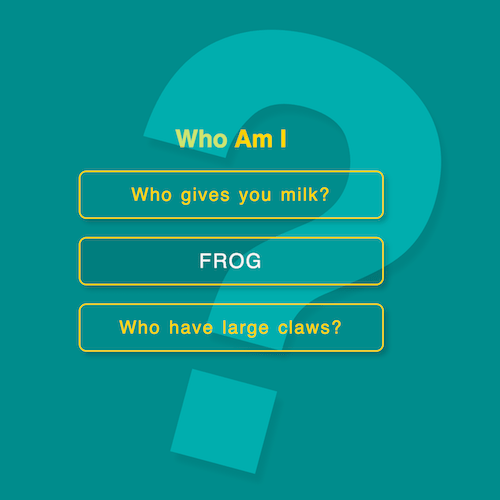

+++
title = '文本滑动 UI'
date = 2018-05-14T15:41:53+08:00
image = '/fe/img/thumbs/021.png'
summary = '#21'
+++



## 效果预览

点击链接可以在 Codepen 预览。

[https://codepen.io/comehope/pen/QrxxaW](https://codepen.io/comehope/pen/QrxxaW)

## 可交互视频教程

此视频是可以交互的，你可以随时暂停视频，编辑视频中的代码。

[https://scrimba.com/p/pEgDAM/cgRgQHr](https://scrimba.com/p/pEgDAM/cgRgQHr)

## 代码解读

定义 dom，容器中包含 question 和 answer：
```html
<div>
	<p>
		<span class="question">Who gives you milk?</span>
		<span class="answer">cow</span>
	</p>
</div>
```

居中显示：
```css
html, body {
	height: 100%;
	display: flex;
	align-items: center;
	justify-content: center;
	background: darkcyan;
}
```

设置文本样式：
```css
p {
	width: 400px;
	height: 2.5em;
	color: gold;
	font-size: 24px;
	border: 2px solid gold;
	line-height: 2.5em;
	text-align: center;
	border-radius: 10px;
	font-family: sans-serif;
	letter-spacing: 2px;
	word-spacing: 2px;
	box-shadow: 5px 5px 10px rgba(0, 0, 0, 0.2);
}
```

设置答案的样式：
```css
p {
	position: relative;
}

p span {
	position: absolute;
	width: 100%;
	top: 0;
	left: 0;
}

p .answer {
	color: whitesmoke;
	font-size: 1.1em;
	text-transform: uppercase;
	background: rgba(0, 0, 0, 0.1);
}
```

增加问题与答案滑动切换的动画效果：
```css
p {
	overflow: hidden;
}

p span {
	transition: 0.5s ease-out;
}

p .question {
	left: 0;
}

p:hover .question {
	left: 100%;
}

p .answer {
	left: -100%;
}

p:hover .answer {
	left: 0;
}
```

dom 中再增加 2 个问题：
```css
<div>
	<p>
		<span class="question">Who gives you milk?</span>
		<span class="answer">cow</span>
	</p>
	<p>
		<span class="question">Who likes to eat flies?</span>
		<span class="answer">frog</span>
	</p>
	<p>
		<span class="question">Who have large claws?</span>
		<span class="answer">crab</span>
	</p>
</div>
```

dom 中增加标题：
```html
<div>
	<h1>Who Am I</h1>
	<p>
		<span class="question">Who gives you milk?</span>
		<span class="answer">cow</span>
	</p>
	<p>
		<span class="question">Who likes to eat flies?</span>
		<span class="answer">frog</span>
	</p>
	<p>
		<span class="question">Who have large claws?</span>
		<span class="answer">crab</span>
	</p>
</div>
```

设置标题样式：
```css
h1 {
	font-family: sans-serif;
	color: gold;
	text-align: center;
}
```

最后，用伪元素增加大问号作为装饰背景：
```css
h1 {
	position: relative;
}

h1::after {
	content: '?';
	position: absolute;
	top: -0.35em;
	left: 0;
	font-size: 25em;
	transform: rotate(15deg);
	color: cyan;
	filter: opacity(0.3);
	text-shadow: 10px 10px 10px rgba(0, 0, 0, 0.2);
}
```
