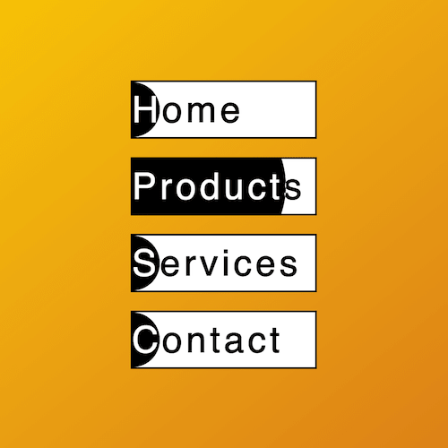

+++
title = '菜单反色填充特效'
date = 2018-05-16T15:42:26+08:00
image = '/test-hugo-deploy/img/thumbs/023.png'
summary = '#23'
+++



## 效果预览

点击链接可以在 Codepen 预览。
[https://codepen.io/comehope/pen/qYMoPo](https://codepen.io/comehope/pen/qYMoPo)

## 可交互视频教程

此视频是可以交互的，你可以随时暂停视频，编辑视频中的代码。

[https://scrimba.com/p/pEgDAM/cE833h6](https://scrimba.com/p/pEgDAM/cE833h6)

## 代码解读

定义 dom，用 <nav> 定义导航栏，但 <li> 中要包含一个 <span>：
```html
<nav>
	<ul>
		<li><span>Home</span></li>
	</ul>
</nav>
```

居中显示：
```css
html, body {
	width: 100%;
	height: 100%;
	display: flex;
	align-items: center;
	justify-content: center;
	background: linear-gradient(to right bottom, gold, chocolate);
}
```

设置文本样式：
```css
nav ul {
	padding: 0;
}

nav ul li {
	font-size: 40px;
	font-family: sans-serif;
	list-style-type: none;
	background-color: white;
	border: 2px solid black;
	letter-spacing: 0.1em;
}
```

为容器设置宽高，此处定义的变量 x 和 y 后面还会用到：
```css
:root {
	--x: 5em;
	--y: 1.5em;
}

nav ul li {
	width: var(--x);
	height: var(--y);
	line-height: var(--y);
}
```

用伪元素画出一个小球，放到菜单项左端：
```css
nav ul li {
	position: relative;
}

nav ul li::before {
	content: '';
	position: absolute;
	height: var(--y);
	width: var(--y);
	background-color: black;
	border-radius: 50%;
	top: 0;
	left: calc(-1 * var(--y) / 2);
}
```

用 mix-blend-mode 设置色彩混合模式，使小球覆盖的文字反色显示：
```css
nav ul li span {
	color: white;
	mix-blend-mode: difference;
}
```

增加动画，使小球从左侧滚到右侧：
```css
nav ul li {
	overflow: hidden;
}

nav ul li::before {
	transition: 0.5s ease-out;
}

nav ul li:hover::before {
	--r: calc(var(--x) * 1.2);
	height: var(--r);
	width: var(--r);
	top: calc(-1 * var(--r) / 2 + var(--y) / 2);
	left: calc(-1 * var(--r) / 2 + var(--x) / 2);
}
```

在 dom 中添加更多的菜单项：
```css
<nav>
	<ul>
		<li><span>Home</span></li>
		<li><span>Products</span></li>
		<li><span>Services</span></li>
		<li><span>Contact</span></li>
	</ul>
</nav>
```

最后，设置一下菜单项之间的间距：
```css
nav ul li {
	margin: 0.5em;
}
```

大功告成！
