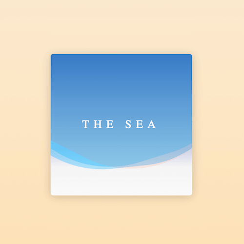

+++
title = '海浪'
date = 2018-05-17T15:42:46+08:00
image = '/test-hugo-deploy/img/thumbs/024.png'
summary = '#24'
+++



## 效果预览

点击链接可以在 Codepen 预览。

[https://codepen.io/comehope/pen/JvmBdE](https://codepen.io/comehope/pen/JvmBdE)

## 可交互视频教程

此视频是可以交互的，你可以随时暂停视频，编辑视频中的代码。

[https://scrimba.com/p/pEgDAM/cp2edUD](https://scrimba.com/p/pEgDAM/cp2edUD)

## 源代码下载

每日前端实战系列的全部源代码请从 github 下载：

[https://github.com/comehope/front-end-daily-challenges](https://github.com/comehope/front-end-daily-challenges)

## 代码解读

定义 dom，容器中包含一行文本和3条做海浪特效的 <span>：
```html
<div class="sea">
	<p class="title">the sea</p>
	<span class="wave"></span>
	<span class="wave"></span>
	<span class="wave"></span>
</div>
```

居中显示：
```css
html, body {
	height: 100%;
	display: flex;
	align-items: center;
	justify-content: center;
	background: linear-gradient(antiquewhite, navajowhite);
}
```

设置容器样式：
```css
.sea {
	width: 300px;
	height: 300px;
	background-color: whitesmoke;
	background-image: linear-gradient(
		darkblue,
		rgba(255, 255, 255, 0) 80%,
		rgba(255, 255, 255, 0.5));
	border-radius: 5px;
	box-shadow: 0 2px 30px rgba(0, 0, 0, 0.2);
}
```

设置文字样式：
```css
.sea {
	position: relative;
}

.sea .title {
	color: white;
	font-size: 24px;
	font-family: serif;
	text-align: center;
	line-height: 250px;
	text-transform: uppercase;
	letter-spacing: 0.4em;
	position: absolute;
	z-index: 1;
	width: 100%;
}
```

制作海浪动画效果：
```css
.sea .wave {
	position: absolute;
	top: -250px;
	left: -100px;
	width: 500px;
	height: 500px;
	background: deepskyblue;
	border-radius: 43%;
	filter: opacity(0.4);
	animation: drift linear infinite;
}

.sea .wave:nth-of-type(1) {
	animation-duration: 5s;
}

.sea .wave:nth-of-type(2) {
	animation-duration: 7s;
}

.sea .wave:nth-of-type(3) {
	animation-duration: 9s;
}

@keyframes drift {
	from {
		transform: rotate(360deg);
	}
}
```

加大海浪的波动幅度，增加颜色差异：
```css
.sea .wave {
	transform-origin: 50% 48%;
}

.sea .wave:nth-of-type(3) {
	background-color: orangered;
	filter: opacity(0.1);
}
```

最后，隐藏容器外的内容：
```css
.sea {
	overflow: hidden;
}
```

大功告成！
