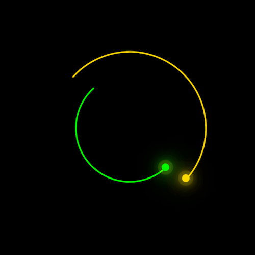

+++
title = '慧星拖尾 loader'
date = 2018-05-18T15:43:03+08:00
image = '/fe/img/thumbs/025.png'
summary = '#25'
+++



## 效果预览

点击链接可以在 Codepen 预览。

[https://codepen.io/comehope/pen/YLRLaM](https://codepen.io/comehope/pen/YLRLaM)

## 可交互视频教程

此视频是可以交互的，你可以随时暂停视频，编辑视频中的代码。

[https://scrimba.com/p/pEgDAM/cGynQUa](https://scrimba.com/p/pEgDAM/cGynQUa)

## 源代码下载

每日前端实战系列的全部源代码请从 github 下载：

[https://github.com/comehope/front-end-daily-challenges](https://github.com/comehope/front-end-daily-challenges)

## 代码解读

定义dom，设置3层容器：
```html
<div class="loader">
    <div class="face">
        <div class="circle"></div>
    </div>
</div>
```

居中显示：
```css
html,
body,
.loader {
    height: 100%;
    display: flex;
    align-items: center;
    justify-content: center;
    background-color: black;
}
```

定义容器尺寸：
```css
.loader {
    width: 200px;
    height: 200px;
    position: relative;
}

.loader .face {
    position: absolute;
    width:100%;
    height: 100%;
    border: 2px solid white;
    border-radius: 50%;
}
```

画出半圆弧：
```css
.loader .face {
    --color: gold;
	border-top-color: var(--color);
    border-left-color: var(--color);
}
```

画出弧线的端点：
```css
.loader .face .circle {
    position: absolute;
    top: 50%;
    left: 50%;
    width: 50%;
    height: 1px;
    background-color: white;
    transform-origin: left;
    transform: rotate(-45deg);
}

.loader .face .circle::before {
    position: absolute;
    top: -5px;
    right: -5px;
    content: '';
    background-color: var(--color);
    width: 10px;
    height: 10px;
    border-radius: 50%;
}
```

给端点增加光晕效果：
```css
.loader .face .circle::before {
    box-shadow: 0 0 20px var(--color),
                0 0 40px var(--color),
                0 0 60px var(--color),
                0 0 80px var(--color),
                0 0 100px var(--color),
                0 0 0 5px rgba(255,255,0,0.1);
}
```

隐藏掉辅助线：
```css
.loader .face {
    border: 2px solid transparent;
}

.loader .face .circle {
    background-color: transparent;
}
```

在 dom 中再增加一条弧线：
```html
<div class="loader">
	<div class="face">
		<div class="circle"></div>
	</div>
	<div class="face">
		<div class="circle"></div>
	</div>
</div>
```

调整2条弧线的直径，变成同心弧：
```css
.loader .face:nth-child(1) {
    width:100%;
    height: 100%;
}

.loader .face:nth-child(2) {
    width:70%;
    height: 70%;
}
```

调整2条弧线的颜色：
```css
.loader .face:nth-child(1) {
    --color: gold;
}

.loader .face:nth-child(2) {
    --color: lime;
}
```

调整2条弧线的端点位置：
```css
.loader .face:nth-child(1) {
    --deg: 0deg;
}

.loader .face:nth-child(2) {
    --deg: 180deg;
}

.loader .face .circle {
    transform: rotate(calc(var(--deg) - 45deg));
}
```

定义动画效果：
```css
.loader .face {
    animation: animate 3s linear infinite;
}

@keyframes animate
{
    from {
        transform: rotate(0deg);
    }
    
    to {
        transform: rotate(360deg);
    }
}
```

最后，让第 2 条弧线反向旋转：
```css
.loader .face:nth-child(2) {
    animation-direction: reverse;
}
```

大功告成！
