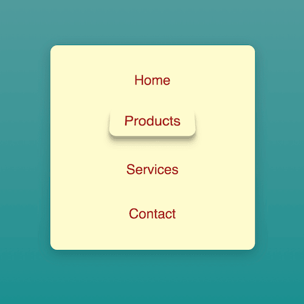

+++
title = '从纸上掀起的按钮'
date = 2018-05-19T15:43:27+08:00
image = '/fe/img/thumbs/026.png'
summary = '#26'
+++



## 效果预览

点击链接可以在 Codepen 预览。

[https://codepen.io/comehope/pen/KRbXGe](https://codepen.io/comehope/pen/KRbXGe)

## 可交互视频教程

此视频是可以交互的，你可以随时暂停视频，编辑视频中的代码。

[https://scrimba.com/c/c3e8dCB](https://scrimba.com/c/c3e8dCB)

## 源代码下载

每日前端实战系列的全部源代码请从 github 下载：

[https://github.com/comehope/front-end-daily-challenges](https://github.com/comehope/front-end-daily-challenges)

## 代码解读

定义 dom，标准的导航版式：
```html
<nav>
	<ul>
		<li>Home</li>
	</ul>
</nav>
```

居中显示：
```css
html, body {
	height: 100%;
	display: flex;
	align-items: center;
	justify-content: center;
	background: linear-gradient(cadetblue, darkcyan);
}
```

设置容器的样式，把背景色声明为变量：
```css
nav {
	width: 300px;
	height: 300px;
	--bgcolor: lemonchiffon;
	background-color: var(--bgcolor);
	box-shadow: 0 5px 30px rgba(0, 0, 0, 0.2);
	border-radius: 10px;
	padding: 30px 0;
	box-sizing: border-box;
}
```

去掉列表符，让菜单项居中显示：
```css
nav ul {
	list-style-type: none;
	margin: 0;
	padding: 0;
	display: flex;
	align-items: center;
	justify-content: center;
	height: 100%;
}
```

设置菜单项的文字样式：
```css
nav ul li {
	color: brown;
	font-size: 20px;
	font-family: sans-serif;
}
```

为菜单项增加鼠标划过效果：
```css
nav ul li {
	padding: 0.5em 1em;
	border-radius: 0.5em;
	transition: 0.5s ease-out;
}

nav ul li:hover {
	box-shadow: 0 4px 4px rgba(0, 0, 0, 0.1),
				0 6px 6px rgba(0, 0, 0, 0.1),
				0 8px 8px rgba(0, 0, 0, 0.1),
				0 12px 12px rgba(0, 0, 0, 0.1);
	transform: scale(1.05) translateY(-0.25em) perspective(300px) rotateX(20deg) ;
}
```

dom 中再增加几个菜单项：
```html
<nav>
	<ul>
		<li>Home</li>
		<li>Products</li>
		<li>Services</li>
		<li>Contact</li>
	</ul>
</nav>
```

最后，调整一下菜单项布局：
```css
nav ul {
	justify-content: space-between;
	flex-direction: column;
}
```

大功告成！
