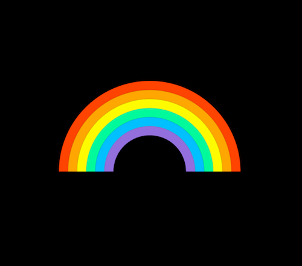

+++
title = '彩虹 loader'
date = 2018-05-20T15:43:46+08:00
image = '/fe/img/thumbs/027.png'
summary = '#27'
+++



## 效果预览

点击链接可以在 Codepen 预览。

[https://codepen.io/comehope/pen/vjvoow](https://codepen.io/comehope/pen/vjvoow)

## 可交互视频教程

此视频是可以交互的，你可以随时暂停视频，编辑视频中的代码。

[https://scrimba.com/p/pEgDAM/cPLGLhV](https://scrimba.com/p/pEgDAM/cPLGLhV)

## 源代码下载

每日前端实战系列的全部源代码请从 github 下载：

[https://github.com/comehope/front-end-daily-challenges](https://github.com/comehope/front-end-daily-challenges)

## 代码解读

定义 dom：
```html
<div class="rainbow">
	<div class="bows">
		<span></span>
		<span></span>
		<span></span>
		<span></span>
		<span></span>
		<span></span>
	</div>
</div>
```

居中显示：
```css
html, body, .bows {
	height: 100%;
	display: flex;
	align-items: center;
	justify-content: center;
	background: black;
}
```

定义彩虹的尺寸：
```css
.rainbow {
	width: 20em;
	height: 10em;
}
```

定义彩虹内拱形的尺寸：
```css
.bows {
	width: 100%;
	height: 200%;
	position: relative;
}
```

定义彩虹内所有拱形共有的特性：
```css
.bows {
	transform: rotate(225deg);
}

.bows span {
	position: absolute;
	width: calc(100% - 2em * (var(--n) - 1));
	height: calc(100% - 2em * (var(--n) - 1));
	border: 1em solid var(--color);
	box-sizing: border-box;
	border-top-color: transparent;
	border-left-color: transparent;
	border-radius: 50%;
}
```

分别设置每个拱形的个性变量：
```css
.bows span:nth-child(1) {
	--n: 1;
	--color: orangered;
}

.bows span:nth-child(2) {
	--n: 2;
	--color: orange;
}

.bows span:nth-child(3) {
  --n: 3;
  --color: yellow;
}

.bows span:nth-child(4) {
  --n: 4;
  --color: mediumspringgreen;
}

.bows span:nth-child(5) {
  --n: 5;
  --color: deepskyblue;
}

.bows span:nth-child(6) {
  --n: 6;
  --color: mediumpurple;
}
```

定义动画效果：
```css
.bows span {
	animation: rotating 3s infinite;
	animation-delay: calc(0.05s * var(--n));
}

@keyframes rotating {
	0%, 20% {
		transform: rotate(0deg);
	}

	80%, 100% {
		transform: rotate(360deg);
	}
}
```

最后，隐藏掉容器之外的内容：
```css
.rainbow {
	overflow: hidden;
}
```

大功告成！

