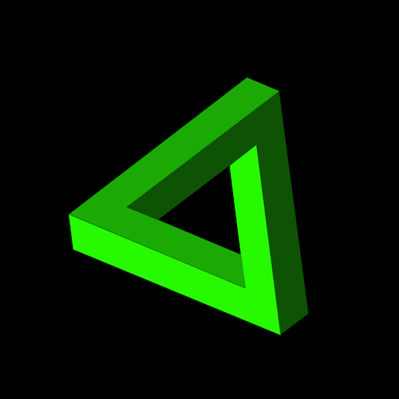

+++
title = '彭罗斯三角形'
date = 2018-05-21T15:44:05+08:00
image = '/test-hugo-deploy/img/thumbs/028.png'
summary = '#28'
+++



## 效果预览

点击链接可以在 Codepen 预览。

[https://codepen.io/comehope/pen/RyvgMZ](https://codepen.io/comehope/pen/RyvgMZ)

## 可交互视频教程

此视频是可以交互的，你可以随时暂停视频，编辑视频中的代码。

[https://scrimba.com/c/czPkasr](https://scrimba.com/c/czPkasr)

## 源代码下载

每日前端实战系列的全部源代码请从 github 下载：

[https://github.com/comehope/front-end-daily-challenges](https://github.com/comehope/front-end-daily-challenges)

## 代码解读

定义 dom，一个容器中包含 3 个 <span>：
```html
<div class="penrose">
	<span></span>
	<span></span>
	<span></span>
</div>
```

居中显示：
```css
html,
body {
	height: 100%;
	display: flex;
	align-items: center;
	justify-content: center;
	background-color: black;
}
```

定义容器尺寸：
```css
.penrose {
	width: 20em;
	height: 20em;
}
```

画出包含 3 条边的容器：
```css
.penrose {
	position: relative;
}

.penrose span {
	position: absolute;
	width: 100%;
	height: 100%;
}

.penrose span:nth-child(1) {
	transform: rotate(0deg);
}

.penrose span:nth-child(2) {
	transform: rotate(120deg);
}

.penrose span:nth-child(3) {
	transform: rotate(240deg);
}
```

为 3 条边所属的容器上色：
```css
.penrose {
	color: red;
}

.penrose span {
	background-color: currentColor;
}

.penrose span:nth-child(1) {
	filter: brightness(1);
}

.penrose span:nth-child(2) {
	filter: brightness(0.66);
}

.penrose span:nth-child(3) {
	filter: brightness(0.33);
}
```

用遮罩切出每一条边，组成彭罗斯三角形：
```css
.penrose span {
	clip-path: polygon(57% 0, 75% 0, 26% 85%, 89.5% 85%, 98.4% 100%, 0 100%);
}

.penrose span:nth-child(2) {
	top: 18.3%;
	left: 43.3%;
}

.penrose span:nth-child(3) {
	top: 46.5%;
	left: 5.9%;
}
```

定义旋转动画效果：
```css
.penrose {
	animation: rotating 30s linear infinite;
	transform-origin: 66% 66%;
}

@keyframes rotating {
	0% {
		transform: rotate(0deg);
	}

	100% {
		transform: rotate(360deg);
	}
}
```

最后，增加旋转时变色的效果：
```css
@keyframes rotating {
	0% {
		color: red;
		transform: rotate(0deg);
	}

	20% {
		color: yellow;
	}

	40% {
		color: lime;
	}

	60% {
		color: blue;
	}

	80% {
		color: fuchsia;
	}

	100% {
		color: red;
		transform: rotate(720deg);
	}
}
```

大功告成！
