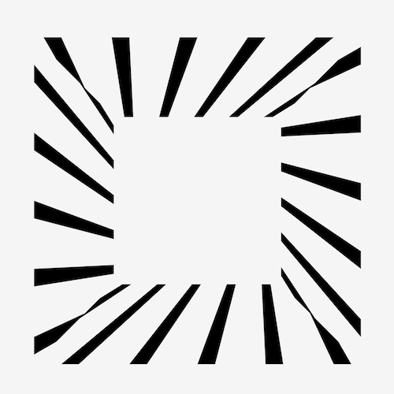

+++
title = 'marquee 动画'
date = 2018-05-22T15:44:23+08:00
image = '/fe/img/thumbs/029.png'
summary = '#29'
+++



## 效果预览

点击链接可以在 Codepen 预览。

[https://codepen.io/comehope/pen/BxbQJj](https://codepen.io/comehope/pen/BxbQJj)

## 可交互视频教程

此视频是可以交互的，你可以随时暂停视频，编辑视频中的代码。

[https://scrimba.com/c/crvq8hq](https://scrimba.com/c/crvq8hq)

## 源代码下载

每日前端实战系列的全部源代码请从 github 下载：

[https://github.com/comehope/front-end-daily-challenges](https://github.com/comehope/front-end-daily-challenges)

## 代码解读
定义 dom，一个容器中包含 4 个子元素，每个子元素的内容就是一堆斜线：
```html
<div class="frame">
	<div class="wall top">////////////////////////////////////////////////////////////////////////////////////////////////////////////////////////////////////////////////////////////////////////////////////</div>
	<div class="wall right">////////////////////////////////////////////////////////////////////////////////////////////////////////////////////////////////////////////////////////////////////////////////////</div>
	<div class="wall bottom">////////////////////////////////////////////////////////////////////////////////////////////////////////////////////////////////////////////////////////////////////////////////////</div>
	<div class="wall left">////////////////////////////////////////////////////////////////////////////////////////////////////////////////////////////////////////////////////////////////////////////////////</div>
</div>
```

居中显示：
```css
body {
	height: 100%;
	display: flex;
	align-items: center;
	justify-content: center;
}
```

定义容器尺寸：
```css
.frame {
	width: 100vmin;
	height: 100vmin;
	background-color: whitesmoke;
}
```

隐藏超出容器的内容：
```css
.wall {
	overflow: hidden;
}
```

把 4 个元素向四个方向旋转，互相垂直：
```css
.wall {
	transform-origin: 0 0;
}

.wall.top {
	transform: rotate(0deg);
}

.wall.right {
	transform: rotate(90deg);
}

.wall.bottom {
	transform: rotate(180deg);
}

.wall.left {
	transform: rotate(270deg);
}
```

定位它们，形成一个正方形：
```css
.frame {
	position: relative;
}

.wall {
	position: absolute;
	width: 100%;
}

.wall.top {
	top: 0;
	left: 0;
}

.wall.right {
	top: 0;
	left: 100%;
}

.wall.bottom {
	top: 100%;
	left: 100%;
}

.wall.left {
	top: 100%;
	left: 0;
}
```

对 4 个元素进行 3d 旋转：
```css
.frame {
	perspective: 40vmin;
}

.wall.top {
	transform: rotate(0deg) rotateX(-90deg);
}

.wall.right {
	transform: rotate(90deg) rotateX(-90deg);
}

.wall.bottom {
	transform: rotate(180deg) rotateX(-90deg);
}

.wall.left {
	transform: rotate(270deg) rotateX(-90deg);
}
```

把斜线加粗、放大：
```css
.wall {
	font-size: 75vmin;
	font-weight: bold;
}
```

最后，把 dom 中的斜线用 <marquee> 标签包围起来：
```html
<div class="frame">
	<div class="wall top"><marquee>////////////////////////////////////////////////////////////////////////////////////////////////////////////////////////////////////////////////////////////////////////////////////</marquee></div>
	<div class="wall right"><marquee>////////////////////////////////////////////////////////////////////////////////////////////////////////////////////////////////////////////////////////////////////////////////////</marquee></div>
	<div class="wall bottom"><marquee>////////////////////////////////////////////////////////////////////////////////////////////////////////////////////////////////////////////////////////////////////////////////////</marquee></div>
	<div class="wall left"><marquee>////////////////////////////////////////////////////////////////////////////////////////////////////////////////////////////////////////////////////////////////////////////////////</marquee></div>
</div>
```

大功告成！
