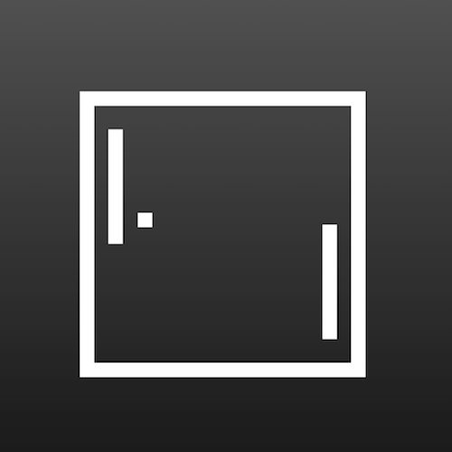

+++
title = '极简乒乓球对打'
date = 2018-05-24T15:45:12+08:00
image = '/test-hugo-deploy/img/thumbs/031.png'
summary = '#31'
+++



## 效果预览

点击链接可以在 Codepen 预览。

[https://codepen.io/comehope/pen/rvgLzK](https://codepen.io/comehope/pen/rvgLzK)

## 可交互视频教程

此视频是可以交互的，你可以随时暂停视频，编辑视频中的代码。

[https://scrimba.com/p/pEgDAM/cW7gZfb](https://scrimba.com/p/pEgDAM/cW7gZfb)

## 源代码下载

每日前端实战系列的全部源代码请从 github 下载：

[https://github.com/comehope/front-end-daily-challenges](https://github.com/comehope/front-end-daily-challenges)

## 代码解读

定义 dom，容器中包含左拍、小球和右拍：
```html
<div class="court">
	<div class="left-paddle"></div>
	<div class="ball"></div>
	<div class="right-paddle"></div>
</div>
```

居中显示：
```css
body {
	height: 100vh;
	display: flex;
	align-items: center;
	justify-content: center;
	background: linear-gradient(silver, dimgray);
}
```

调整盒模型：
```css
* {
	box-sizing: border-box;
}
```

画出球案：
```css
.court {
	width: 20em;
	height: 20em;
	color: white;
	border: 1em solid currentColor;
}
```

画出左拍：
```css
.court {
	position: relative;
}

.left-paddle
	width: 1em;
	height: calc(50% - 1em);
	background-color: currentColor;
	position: absolute;
	top: 1em;
	left: 1em;
}
```

让左拍动起来：
```css
.left-paddle {
	animation: left-moving 1s linear infinite alternate;
}

@keyframes left-moving {
	to {
		transform: translateY(100%);
	}
}
```

类似地，画出右拍：
```css
.right-paddle
	width: 1em;
	height: calc(50% - 1em);
	background-color: currentColor;
	position: absolute;
	top: 1em;
	left: 1em;
	bottom: 1em;
	right: 1em;
}
```

类似地，让右拍动起来：
```css
.right-paddle {
	animation: right-moving 1s linear infinite alternate;
}

@keyframes right-moving {
	to {
		transform: translateY(-100%);
	}
}
```

画出小球：
```css
.ball {
	width: 100%;
	height: 1em;
	border-left: 1em solid currentColor;
	position: absolute;
	left: 2em;
	top: calc(50% - 1.5em);
}
```

让小球动起来：
```css
.ball {
	animation: bounce 1s linear infinite alternate;
}

@keyframes bounce {
	to {
		left: calc(100% - 3em);
	}
}
```

最后，重构一下左右拍的代码，合并共有属性：
```css
.left-paddle,
.right-paddle {
	width: 1em;
	height: calc(50% - 1em);
	background-color: currentColor;
	position: absolute;
	animation: 1s linear infinite alternate;
}

.left-paddle {
	top: 1em;
	left: 1em;
	animation-name: left-moving;
}

.right-paddle {
	bottom: 1em;
	right: 1em;
	animation-name: right-moving;
}
```

大功告成！

