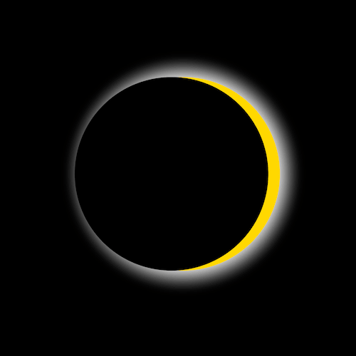

+++
title = '日蚀'
date = 2018-05-29T15:46:35+08:00
image = '/fe/img/thumbs/036.png'
summary = '#36'
+++



## 效果预览

点击链接可以在 Codepen 预览。

[https://codepen.io/comehope/pen/OELvrK](https://codepen.io/comehope/pen/OELvrK)

## 可交互视频教程

此视频是可以交互的，你可以随时暂停视频，编辑视频中的代码。

[https://scrimba.com/p/pEgDAM/cgnzMAz](https://scrimba.com/p/pEgDAM/cgnzMAz)

## 源代码下载

每日前端实战系列的全部源代码请从 github 下载：

[https://github.com/comehope/front-end-daily-challenges](https://github.com/comehope/front-end-daily-challenges)

## 代码解读

定义 dom，一个名为 sky 的容器，其中包含一个 sun 元素和一个 moon 元素：
```html
<div class="sky">
	<div class="sun"></div>
	<div class="moon"></div>
</div>
```

画出天空：
```css
body {
	margin: 0;
}

.sky {
	width: 100vw;
	height: 100vh;
	background-color: skyblue;
}
```

画出太阳：
```css
.sky {
	display: flex;
	align-items: center;
	justify-content: center;
	position: relative;
}

.sun {
	position: absolute;
	width: 50vmin;
	height: 50vmin;
	border-radius: 50%;
	background-color: gold;
}
```

画出月亮：
```css
.moon {
	position: absolute;
	width: 50vmin;
	height: 50vmin;
	border-radius: 50%;
	background-color: slategray;
	transform: translateX(-55vmin);
}
```

定义天空的变化，当日蚀来临时天空会变黑：
```css
@keyframes animate-sky {
	50% {
		background-color: black;
	}
}
```

定义太阳的变化，当日蚀来临时太阳虽会被遮挡，但光晕仍会透出：
```css
@keyframes animate-sun {
	50% {
		box-shadow: 0 0 5em 1em white;
	}
}
```

定义月亮的动画，当它运动到和太阳重叠的位置时，因为没有光，就看不到它的颜色了：
```css
@keyframes animate-moon {
	from {
		transform: translateX(-100vmin);
	}

	50% {
		background-color: black;
	}

	to {
		transform: translateX(100vmin);
	}
}
```

把动画应用到元素上：
```css
.sky,
.sun,
.moon {
	animation: 10s linear infinite;
}

.sky {
	animation-name: animate-sky;
}

.sun {
	animation-name: animate-sun;
}

.moon {
	animation-name: animate-moon;
}
```

最后，隐藏滚动条：
```css
.sky {
	overflow: hidden;
}
```

大功告成！
