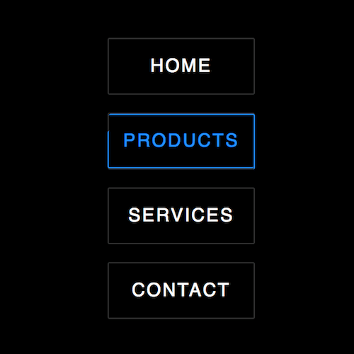

+++
title = '描边按钮'
date = 2018-05-30T15:47:08+08:00
image = '/fe/img/thumbs/037.png'
summary = '#37'
+++



## 效果预览

点击链接可以在 Codepen 预览。

[https://codepen.io/comehope/pen/mKdzZM](https://codepen.io/comehope/pen/mKdzZM)

## 可交互视频教程

此视频是可以交互的，你可以随时暂停视频，编辑视频中的代码。

[https://scrimba.com/p/pEgDAM/cgnk6Sb](https://scrimba.com/p/pEgDAM/cgnk6Sb)

## 源代码下载

每日前端实战系列的全部源代码请从 github 下载：

[https://github.com/comehope/front-end-daily-challenges](https://github.com/comehope/front-end-daily-challenges)

## 代码解读

定义 dom，标准的导航模式：
```html
<nav>
	<ul>
		<li>Home</li>
	</ul>
</nav>
```

居中显示：
```css
body {
	margin: 0;
	height: 100vh;
	display: flex;
	align-items: center;
	justify-content: center;
	background-color: black;
}
```

定义文本和按钮边框样式：
```css
nav ul {
	padding: 0;
}

nav ul li {
	color: white;
	list-style-type: none;
	font-size: 32px;
	font-family: sans-serif;
	text-transform: uppercase;
	width: 12em;
	height: 4em;
	border: 1px solid rgba(255, 255, 255, 0.2);
	text-align: center;
	line-height: 4em;
	letter-spacing: 0.2em;
}
```

用 before 伪元素定义上边框和右边框，其中边框颜色因会多次被用到，所以采用变量：
```css
:root {
	--color: dodgerblue;
}

nav ul li::before {
	content: '';
	position: absolute;;
	width: 0;
	height: 0;
	visibility: hidden;
	top: 0;
	left: 0;
	border-top: 1px solid var(--color);
	border-right: 1px solid var(--color);
}
```

类似地，用 after 伪元素定义右边框和下边框：
```css
nav ul li::after {
	content: '';
	position: absolute;;
	width: 0;
	height: 0;
	visibility: hidden;
	bottom: 0;
	right: 0;
	border-bottom: 1px solid var(--color);
	border-left: 1px solid var(--color);
}
```

设计边框入场的动画效果，按上、右、下、左的顺序依次显示边框，为了方便调整动画的速度设置了与时间相关的变量：
```css
:root {
	--time-slot-length: 0.1s;
	--t1x: var(--time-slot-length);
	--t2x: calc(var(--time-slot-length) * 2);
	--t3x: calc(var(--time-slot-length) * 3);
	--t4x: calc(var(--time-slot-length) * 4);
}

nav ul li:hover::before,
nav ul li:hover::after {
	width: 100%;
	height: 100%;
	visibility: visible;
}

nav ul li:hover::before {
	transition:
		visibility 0s,
		width linear var(--t1x),
		height linear var(--t1x) var(--t1x);
}

nav ul li:hover::after {
	transition: 
		visibility 0s var(--t2x),
		width linear var(--t1x) var(--t2x),
		height linear var(--t1x) var(--t3x);
}
```

设计边框出场的动画效果，与入场的顺序相反：
```css
nav ul li::before {
	transition:
		height linear var(--t1x) var(--t2x),
		width linear var(--t1x) var(--t3x),
		visibility 0s var(--t4x);
}

nav ul li::after {
	transition:
		height linear var(--t1x),
		width linear var(--t1x) var(--t1x),
		visibility 0s var(--t2x);
}
```

让按钮文字在描边期间变色：
```css
nav ul li {
	transition: var(--t4x);
}

nav ul li:hover {
	color: var(--color);
}
```

最后，在描边结束后，在按钮四周增加一个脉冲动画，加强动感：
```css
nav ul li:hover {
	animation: pulse ease-out 1s var(--t4x);
}

@keyframes pulse {
	from {
		box-shadow: 0 0 rgba(30, 144, 255, 0.4);
	}

	to {
		box-shadow: 0 0 0 1em rgba(30, 144, 255, 0);
	}
}
```

大功告成！
