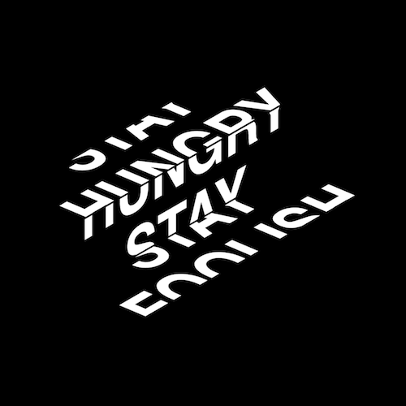

+++
title = '阶梯文字'
date = 2018-05-31T15:47:26+08:00
image = '/fe/img/thumbs/038.png'
summary = '#38'
+++



## 效果预览

点击链接可以在 Codepen 预览。

[https://codepen.io/comehope/pen/MXYBEM](https://codepen.io/comehope/pen/MXYBEM)

## 可交互视频教程

此视频是可以交互的，你可以随时暂停视频，编辑视频中的代码。

[https://scrimba.com/p/pEgDAM/cEQMJAK](https://scrimba.com/p/pEgDAM/cEQMJAK)

## 源代码下载

每日前端实战系列的全部源代码请从 github 下载：

[https://github.com/comehope/front-end-daily-challenges](https://github.com/comehope/front-end-daily-challenges)

## 代码解读

定义 dom，容器中包含 1 个段落，段落中包含几个单词：
```html
<div class="container">
	<p>
		<span>stay</span>
		<span>hungry</span>
		<span>stay</span>
		<span>foolish</span>
	</p>
</div>
```

居中显示：
```css
body {
	margin: 0;
	height: 100vh;
	display: flex;
	align-items: center;
	justify-content: center;
	background: black;
}
```

设置文字样式：
```css
.container p {
	color: white;
    font-size: 60px;
    font-family: sans-serif;
    font-weight: bold;
    text-transform: uppercase;
}

.container p span {
	display: block;
	text-align: center;
}
```

修改 dom，把文本分成每相邻的 2 句为一组，4 句话一共分成 3 组：
```html
<div class="container">
	<p>
		<span>stay</span>
		<span>hungry</span>
	</p>
	<p>
		<span>hungry</span>
		<span>stay</span>
	</p>
	<p>
		<span>stay</span>
		<span>foolish</span>
	</p>
</div>
```

把段落的行高改为 1 行文本高，3 个段落各占一行：
```css
.container p {
	margin: 0;
	height: 1em;
	overflow: hidden;
}

.container p span {
	line-height: 1em;
}
```

让文字倾斜变形：
```css
.container p:nth-child(odd) {
	transform: skewY(-30deg) skewX(45deg) scaleY(1.3333);
}

.container p:nth-child(even) {
	transform: skewY(-30deg) scaleY(1.3333);
}
```

定义让文字上下移动的动画：
```css
.container p span {
	animation: lettering 3s infinite ease-in-out alternate;
}

@keyframes lettering {
	to {
		transform: translateY(-100%);
	}
}
```

对齐文字：
```css
.container p:nth-child(2) {
	margin-left: 1.3em;
}

.container p:nth-child(3) {
	margin-left: 2.6em;
}
```

最后，让文字偏左一些，抵销因倾斜造成的位移：
```css
.container p {
	position: relative;
	left: -0.8em;
}
```

大功告成！
