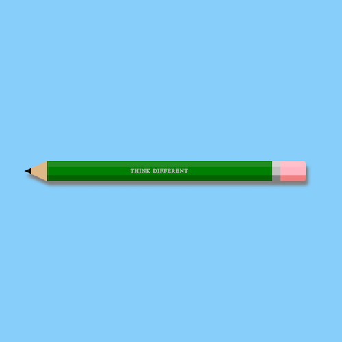

+++
title = '铅笔'
date = 2018-06-03T15:48:20+08:00
image = '/fe/img/thumbs/041.png'
summary = '#41'
+++



## 效果预览

点击链接可以在 Codepen 预览。

[https://codepen.io/comehope/pen/PaZYBw](https://codepen.io/comehope/pen/PaZYBw)

## 可交互视频教程

此视频是可以交互的，你可以随时暂停视频，编辑视频中的代码。

[https://scrimba.com/p/pEgDAM/cEQqefK](https://scrimba.com/p/pEgDAM/cEQqefK)

## 源代码下载

每日前端实战系列的全部源代码请从 github 下载：

[https://github.com/comehope/front-end-daily-challenges](https://github.com/comehope/front-end-daily-challenges)

## 代码解读

定义dom, 容器中包含笔头、笔杆（包含文字）和橡皮 3 部分：
```html
<div class="pencil">
	<span class="taper"></span>
	<span class="barrel">made in China</span>
	<span class="eraser"></span>
</div>
```

居中显示
```css
body {
	margin: 0;
	height: 100vh;
	display: flex;
	align-items: center;
	justify-content: center;
	background-color: lightskyblue;
}
```

定义铅笔的尺寸
```css
.pencil {
	position: relative;
	width: 50em;
	height: 3.5em;
}
```

画出笔杆：
```css
.pencil .barrel {
	position: absolute;
	width: 40em;
	left: 4em;
	background-color: green;
	border-top: 1em solid forestgreen;
	border-bottom: 1em solid darkgreen;
}
```

设置笔杆上文字的样式：
```css
.pencil .barrel {
	line-height: 1.5em;
	font-family: sans-serif;
	text-transform: uppercase;
	color: silver;
	text-align: center;
}
```

用伪元素画出笔头：
```css
.pencil .taper::before,
.pencil .taper::after {
	content: '';
	position: absolute;
	left: -4em;
	border-style: solid;
	border-width: calc(3.5em / 2) 4em;
}

.pencil .taper::before {
	border-color: transparent burlywood transparent transparent;
}

.pencil .taper::after {
	border-color: transparent green transparent transparent;
	transform: scale(0.3);
}
```

画出橡皮：
```css
.pencil .eraser {
	position: absolute;
	right: 0;
	width: 6em;
	height: 1.5em;
	background-color: lightpink;
	border-top: 1em solid pink;
	border-bottom: 1em solid lightcoral;
	border-top-right-radius: 0.5em;
	border-bottom-right-radius: 0.5em;
}
```

用伪元素画出橡皮上的铁箍：
```css
.pencil .eraser::before {
	content: '';
	position: absolute;
	top: -1em;
	left: 0;
	width: 1.5em;
	height: 1.5em;
	background-color: silver;
	border-top: 1em solid lightgray;
	border-bottom: 1em solid gray;
}
```

最后，增加阴影：
```css
.pencil {
	filter: drop-shadow(5px 10px 3px gray);
}
```

大功告成！
