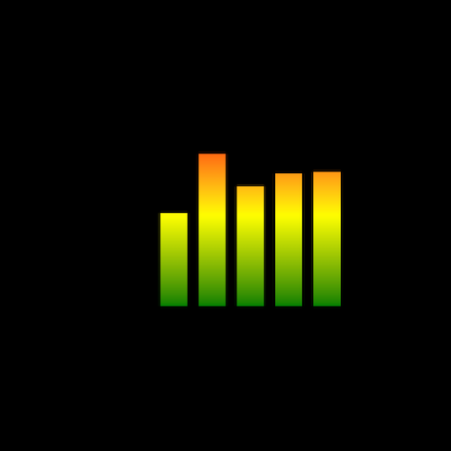

+++
title = '均衡器'
date = 2018-06-04T15:50:38+08:00
image = '/fe/img/thumbs/042.png'
summary = '#42'
+++



## 效果预览

点击链接可以在 Codepen 预览。

[https://codepen.io/comehope/pen/oybWBy](https://codepen.io/comehope/pen/oybWBy)

## 可交互视频教程

此视频是可以交互的，你可以随时暂停视频，编辑视频中的代码。

[https://scrimba.com/p/pEgDAM/cG64puy](https://scrimba.com/p/pEgDAM/cG64puy)

## 源代码下载

每日前端实战系列的全部源代码请从 github 下载：

[https://github.com/comehope/front-end-daily-challenges](https://github.com/comehope/front-end-daily-challenges)

## 代码解读

定义 dom，容器中包含 5 个子元素：
```html
<div class="equalizer">
	<span></span>
	<span></span>
	<span></span>
	<span></span>
	<span></span>
</div>
```

居中显示：
```css
body {
	margin: 0;
	height: 100vh;
	display: flex;
	align-items: center;
	justify-content: center;
	background-color: black;
}
```

定义均衡器的样式：
```css
.equalizer {
	width: 10em;
	height: 10em;
	display: flex;
	justify-content: space-between;
}

.equalizer span {
	width: 1.5em;
	background: linear-gradient(0deg, green, yellow, red);
}
```

定义均衡器竖条的动画效果：
```css
.equalizer span {
	animation: up-and-down 2s linear infinite;
}

@keyframes up-and-down{
	0%, 100% {
		clip-path: inset(27% 0 0 0);
	}

	10% {
		clip-path: inset(17% 0 0 0);
	}

	20% {
		clip-path: inset(55% 0 0 0);
	}

	30% {
		clip-path: inset(30% 0 0 0);
	}

	40% {
		clip-path: inset(13% 0 0 0);
	}

	50% {
		clip-path: inset(38% 0 0 0);
	}

	60% {
		clip-path: inset(80% 0 0 0);
	}

	70% {
		clip-path: inset(21% 0 0 0);
	}

	80% {
		clip-path: inset(0% 0 0 0);
	}

	90% {
		clip-path: inset(36% 0 0 0);
	}
}
```

最后，设置各竖条依次动画：
```css
.equalizer span {
	animation: up-and-down 2s linear infinite calc(-1 * 0.4s * (var(--n) - 1));
}

.equalizer span:nth-child(1) {
	--n: 1;
}

.equalizer span:nth-child(2) {
	--n: 2;
}

.equalizer span:nth-child(3) {
	--n: 3;
}

.equalizer span:nth-child(4) {
	--n: 4;
}

.equalizer span:nth-child(5) {
	--n: 5;
}
```

大功告成！
