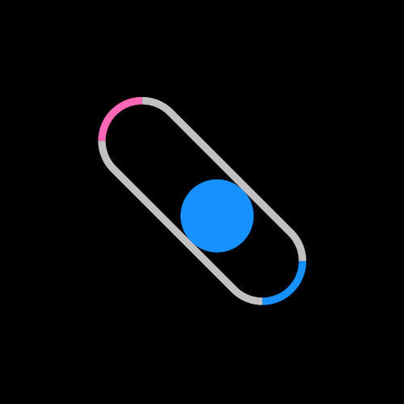

+++
title = '在容器中反弹的小球'
date = 2018-06-08T17:03:31+08:00
image = '/fe/img/thumbs/046.png'
summary = '#46'
+++



## 效果预览

点击链接可以在 Codepen 预览。

[https://codepen.io/comehope/pen/jKVbyE](https://codepen.io/comehope/pen/jKVbyE)

## 可交互视频教程

此视频是可以交互的，你可以随时暂停视频，编辑视频中的代码。

[https://scrimba.com/p/pEgDAM/cD8nMUr](https://scrimba.com/p/pEgDAM/cD8nMUr)

## 源代码下载

每日前端实战系列的全部源代码请从 github 下载：

[https://github.com/comehope/front-end-daily-challenges](https://github.com/comehope/front-end-daily-challenges)

## 代码解读

定义 dom，只有一个元素：
```html
<div class="loader"></div>
```

居中显示：
```css
body {
	margin: 0;
	height: 100vh;
	display: flex;
	align-items: center;
	justify-content: center;
	background-color: black;
}
```

定义容器的尺寸：
```css
.loader {
	width: 10em;
	height: 3em;
	border: 0.3em solid silver;
	border-radius: 3em;
	font-size: 20px;
}
```

把容器左右两侧分别涂上不同的颜色：
```css
.loader {
	border-left-color: hotpink;
	border-right-color: dodgerblue;
}
```

在容器中画一个小球：
```css
.loader {
	position: relative;
}

.loader::before {
	content: '';
	position: absolute;
	top: 0;
	left: 0;
	width: 3em;
	height: 3em;
	border-radius: 50%;
	background-color: dodgerblue;
}
```

让小球在容器中往复移动：
```css
.loader::before {
	animation: shift 3s linear infinite;
}

@keyframes shift {
	50% {
		left: 7em;
	}
}
```

再让小球在撞到两端时变色：
```css
.loader::before {
	animation:
		shift 3s linear infinite,
		change-color 3s linear infinite;
}

@keyframes change-color {
	0%, 55% {
		background-color: dodgerblue;
	}

	5%, 50% {
		background-color: hotpink;
	}
}
```

最后，让容器不停地旋转：
```css
.loader {
	animation: spin 3s linear infinite;
}

@keyframes spin {
	to {
		transform: rotate(360deg);
	}
}
```

大功告成！
