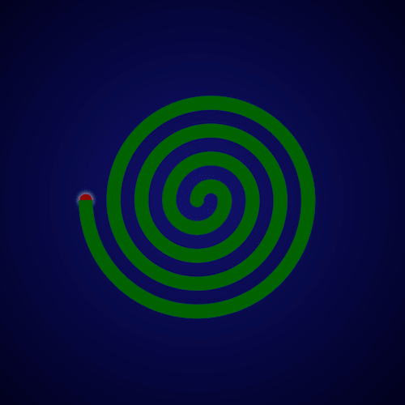

+++
title = '蚊香'
date = 2018-06-11T17:06:09+08:00
image = '/test-hugo-deploy/img/thumbs/048.png'
summary = '#48'
+++



## 效果预览

点击链接可以在 Codepen 预览。

[https://codepen.io/comehope/pen/BVpvMz](https://codepen.io/comehope/pen/BVpvMz)

## 可交互视频教程

此视频是可以交互的，你可以随时暂停视频，编辑视频中的代码。

[https://scrimba.com/p/pEgDAM/cZ8Ebf7](https://scrimba.com/p/pEgDAM/cZ8Ebf7)

## 源代码下载

每日前端实战系列的全部源代码请从 github 下载：

[https://github.com/comehope/front-end-daily-challenges](https://github.com/comehope/front-end-daily-challenges)

## 代码解读

定义 dom，容器中包含 8 个子元素：
```html
<div class="coil">
	<span></span>
	<span></span>
	<span></span>
	<span></span>
	<span></span>
	<span></span>
	<span></span>
	<span></span>
</div>
```

居中显示：
```css
body {
	margin: 0;
	height: 100vh;
	display: flex;
	align-items: center;
	justify-content: center;
	background: radial-gradient(circle at center, midnightblue, black);
}
```

画出纹香盘要用的框线：
```css
.coil {
    position: relative;
    display: flex;
    justify-content: center;
}

.coil span {
    position: absolute;
    width: calc((var(--n) * 2 - 1) * 1em);
    height: calc((var(--n) - 0.5) * 1em);
    border: 1em solid darkgreen;
}

.coil span:nth-child(1) {
    --n: 1;
}

.coil span:nth-child(2) {
    --n: 2;
}

.coil span:nth-child(3) {
    --n: 3;
}

.coil span:nth-child(4) {
    --n: 4;
}

.coil span:nth-child(5) {
    --n: 5;
}

.coil span:nth-child(6) {
    --n: 6;
}

.coil span:nth-child(7) {
    --n: 7;
}

.coil span:nth-child(8) {
    --n: 8;
}
```

把一半框线放置到上方：
```css
.coil span:nth-child(odd) {
    align-self: flex-end;
}
```

删除掉上方框线的下边框，和下方框线的上边框：
```css
.coil span:nth-child(odd) {
    border-bottom: none;
}

.coil span:nth-child(even) {
    border-top: none;
}
```

对齐上下边框：
```css
.coil span:nth-child(even) {
    transform: translateX(-1em);
}
```

把边框改为曲线：
```css
.coil span:nth-child(odd) {
    border-radius: 50% 50% 0 0 / 100% 100% 0 0;
}

.coil span:nth-child(even) {
    border-radius: 0 0 50% 50% / 0 0 100% 100%;
}
```

用伪元素画出蚊香最中间的部分：
```css
.coil::before {
    content: '';
    position: absolute;
    width: 1em;
    height: 1em;
    background-color: darkgreen;
    border-radius: 50%;
    left: -1.5em;
    top: -0.5em;
}
```

用伪元素画出蚊香的燃点：
```css
.coil::after {
    content: '';
    position: absolute;
    width: 1em;
    height: 1em;
    border-radius: 50%;
    top: -0.5em;
    background-color: darkred;
    left: -9.5em;
    z-index: -1;
    transform: scale(0.9);
    box-shadow: 0 0 1em white;
}
```

最后，为燃点增加闪动的效果：
```css
.coil::after {
    animation: blink 1s linear infinite alternate;
}

@keyframes blink {
    to {
        box-shadow: 0 0 0 white;
    }
}
```

大功告成！
