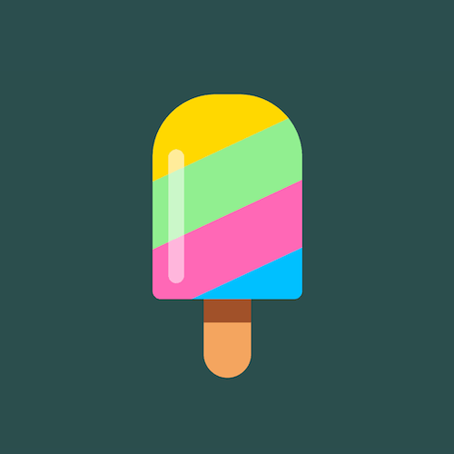

+++
title = '冰棍'
date = 2018-06-12T17:06:27+08:00
image = '/fe/img/thumbs/049.png'
summary = '#49'
+++



## 效果预览

点击链接可以在 Codepen 预览。

[https://codepen.io/comehope/pen/vrxzMw](https://codepen.io/comehope/pen/vrxzMw)

## 可交互视频教程

此视频是可以交互的，你可以随时暂停视频，编辑视频中的代码。

[https://scrimba.com/p/pEgDAM/cnpZEAZ](https://scrimba.com/p/pEgDAM/cnpZEAZ)

## 源代码下载

每日前端实战系列的全部源代码请从 github 下载：

[https://github.com/comehope/front-end-daily-challenges](https://github.com/comehope/front-end-daily-challenges)

## 代码解读

定义 dom，容器中包含 2 个元素：
```html
<div class="ice-lolly">
	<div class="flavors"></div>
	<div class="stick"></div>
</div>
```

居中显示：
```css
body {
	margin: 0;
	height: 100vh;
	display: flex;
	align-items: center;
	justify-content: center;
	background-color: darkslategray;
}
```

绘制出冰棍的外形：
```css
.flavors {
	width: 19em;
	height: 26em;
	font-size: 10px;
	border-radius: 8em 8em 1em 1em;
}
```

给冰棍上色：
```css
.flavors {
	position: relative;
	overflow: hidden;
}

.flavors::before {
	content: '';
	position: absolute;
	width: 140%;
	height: 120%;
	background: linear-gradient(
		hotpink 0%,
		hotpink 25%,
		deepskyblue 25%,
		deepskyblue 50%,
		gold 50%,
		gold 75%,
		lightgreen 75%,
		lightgreen 100%);
	z-index: -1;
	left: -20%;
	transform: rotate(-25deg);
}
```

来一点光照效果：
```css
.flavors::after {
	content: '';
	position: absolute;
	width: 2em;
	height: 17em;
	background-color: rgba(255, 255, 255, 0.5);
	left: 2em;
	bottom: 2em;
	border-radius: 1em;
}
```

画出冰棍筷子：
```css
.stick {
	position: relative;
	width: 6em;
	height: 8em;
	background-color: sandybrown;
	left: calc(50% - 6em / 2);
	border-radius: 0 0 3em 3em;
}
```

给冰棍筷子加一点阴影，增加立体感：
```css
.stick::after {
	content: '';
	position: absolute;
	width: inherit;
	height: 2.5em;
	background-color: sienna;
}
```

让冰棍的色彩滚动起来：
```css
.flavors::before {
	animation: moving 100s linear infinite;
}

@keyframes moving {
	to {
		background-position: 0 1000vh;
	}
}
```

最后，增加交互效果，当鼠标悬停时才播放动画：
```css
.flavors::before {
	animation-play-state: paused;
}

.ice-lolly:hover .flavors::before {
	animation-play-state: running;
}
```

大功告成！
