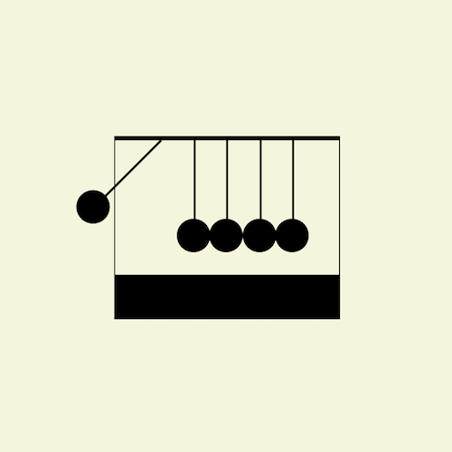

+++
title = '牛顿摆'
date = 2018-06-13T17:06:45+08:00
image = '/fe/img/thumbs/050.png'
summary = '#50'
+++



## 效果预览

点击链接可以在 Codepen 预览。

[https://codepen.io/comehope/pen/qKmGaJ](https://codepen.io/comehope/pen/qKmGaJ)

## 可交互视频教程

此视频是可以交互的，你可以随时暂停视频，编辑视频中的代码。

[https://scrimba.com/p/pEgDAM/cPpkyUK](https://scrimba.com/p/pEgDAM/cPpkyUK)

## 代码解读
定义dom，容器中包含 5 个子元素：
```html
<div class="loader">
	<span></span>
	<span></span>
	<span></span>
	<span></span>
	<span></span>
</div>
```

居中显示：
```css
body {
	margin: 0;
	height: 100vh;
	display: flex;
	align-items: center;
	justify-content: center;
	background-color: beige;
}
```

画出小球的挂线：
```css
.loader {
	position: absolute;
	display: flex;
	width: 12em;
	font-size: 10px;
	justify-content: space-between;
}

.loader span {
	position: relative;
	width: 0.2em;
	height: 10em;
	background-color: black;
	transform-origin: top;
}
```

画出小球：
```css
.loader span::before {
	content: '';
	position: absolute;
	bottom: 0;
	width: 3em;
	height: 3em;
	border-radius: 50%;
	background-color: black;
	left: -1.4em;
}
```

画出牛顿摆的挂架：
```css
.loader {
	border-style: solid;
	border-color: black;
	border-width: 0.4em 0.1em 4em 0.1em;
	padding: 0 4em 2em 4em;
}
```

让最左侧的摆线晃动：
```css
.loader span:first-child {
    animation: moving-up 0.75s cubic-bezier(0.215, 0.61, 0.355, 1) infinite alternate;
    --direction: 1;
}

@keyframes moving-up {
    0%{
        transform: rotate(0deg);
    }

    50%{
        transform: rotate(0deg);
    }

    100%{
        transform: rotate(calc(45deg * var(--direction)));
    }
}
```

最后，让最右侧的摆线晃动：
```css
.loader span:last-child {
    animation: moving-up 0.75s cubic-bezier(0.215, 0.61, 0.355, 1) infinite alternate-reverse;
    --direction: -1;
}
```

大功告成！
