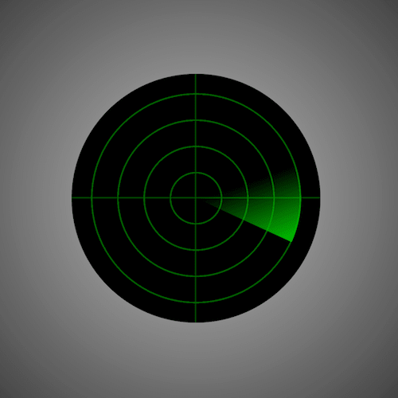

+++
title = '雷达扫描'
date = 2018-06-14T17:07:00+08:00
image = '/test-hugo-deploy/img/thumbs/051.png'
summary = '#51'
+++



## 效果预览

点击链接可以在 Codepen 预览。

[https://codepen.io/comehope/pen/VdbGvr](https://codepen.io/comehope/pen/VdbGvr)

## 可交互视频

此视频是可以交互的，你可以随时暂停视频，编辑视频中的代码。

[https://scrimba.com/p/pEgDAM/cky6wfa](https://scrimba.com/p/pEgDAM/cky6wfa)

## 源代码下载

每日前端实战系列的全部源代码请从 github 下载：

[https://github.com/comehope/front-end-daily-challenges](https://github.com/comehope/front-end-daily-challenges)

## 代码解读

定义 dom，只有一个元素：
```html
<div class="radar"></div>
```

居中显示：
```css
body {
	margin: 0;
	height: 100vh;
	display: flex;
	align-items: center;
	justify-content: center;
	background: radial-gradient(circle at center, silver, black);
}
```

设置容器的尺寸，背景为黑色：
```css
.radar {
	width: 8em;
	height: 8em;
	font-size: 32px;
	background: 
		linear-gradient(black, black);
}
```

在背景上画出4个同心圆：
```css
.radar {
	background: 
			repeating-radial-gradient(
				transparent 0, 
				transparent 0.95em, 
				darkgreen 0.95em, 
				darkgreen 1em),
			linear-gradient(black, black);
}
```

在背景上再画出十字坐标线：
```css
.radar {
	background: 
			linear-gradient(
				90deg,
				transparent 49.75%,
				darkgreen 49.75%,
				darkgreen 50.25%,
				transparent 50.25%),
			linear-gradient(
				transparent 49.75%,
				darkgreen 49.75%,
				darkgreen 50.25%,
				transparent 50.25%),
			repeating-radial-gradient(
				transparent 0, 
				transparent 0.95em, 
				darkgreen 0.95em, 
				darkgreen 1em),
			linear-gradient(black, black);
}
```

用伪元素画出面积等于容器面积四分之一的正方形：
```css
.radar {
	position: relative;
}

.radar::before {
	content: '';
	position: absolute;
	width: calc(8em / 2);
	height: calc(8em / 2);
}
```

把正方形变为有拖尾效果的扇形：
```css
.radar::before {
	background: linear-gradient(
			45deg,
			rgba(0, 0, 0, 0) 50%,
			rgba(0, 192, 0, 1) 100%
		);
	border-radius: 100% 0 0 0;
}
```

把容器改为圆形：
```css
.radar {
	border-radius: 50%;
}
```

为容器增加一点边距，以便清晰地展示最外侧的同心圆：
```css
.radar {
	width: calc(8em + 1.5em);
	height: calc(8em + 1.5em);
}

.radar::before {
	top: calc(1.5em / 2);
	left: calc(1.5em / 2);
}
```

最后，为拖尾增加转动效果：
```css
.radar::before {
	animation: scaning 5s linear infinite;
	transform-origin: 100% 100%;
}

@keyframes scaning {
	to {
		transform: rotate(360deg);
	}
}
```

大功告成！
