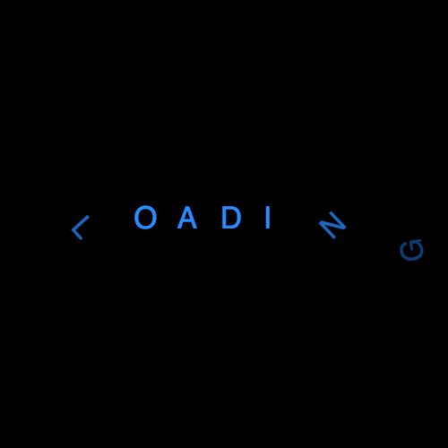

+++
title = '文本淡入淡出 loader'
date = 2018-06-16T17:07:32+08:00
image = '/fe/img/thumbs/053.png'
summary = '#53'
+++



## 效果预览

点击链接可以在 Codepen 预览。

[https://codepen.io/comehope/pen/ERwpeG](https://codepen.io/comehope/pen/ERwpeG)

## 可交互视频

此视频是可以交互的，你可以随时暂停视频，编辑视频中的代码。

[https://scrimba.com/p/pEgDAM/cED8KsK](https://scrimba.com/p/pEgDAM/cED8KsK)

## 源代码下载

每日前端实战系列的全部源代码请从 github 下载：

[https://github.com/comehope/front-end-daily-challenges](https://github.com/comehope/front-end-daily-challenges)

## 代码解读

定义 dom，容器是包含 7 个子元素，每个子元素中有一个字母：
```html
<div class="loader">
	<span>l</span>
	<span>o</span>
	<span>a</span>
	<span>d</span>
	<span>i</span>
	<span>n</span>
	<span>g</span>
</div>
```

居中显示：
```css
body {
	margin: 0;
	height: 100vh;
	display: flex;
	align-items: center;
	justify-content: center;
	background-color: black;
}
```

设置容器尺寸：
```css
.loader {
	width: 40em;
	height: 3em;
}
```

设置文字样式：
```css
.loader {
	color: dodgerblue;
	font-size: 1.5em;
	text-transform: uppercase;
	font-family: sans-serif;
}
```

给文字增加渐隐渐显动画：
```css
.loader span {
	animation: moving 2s linear infinite;
}

@keyframes moving {
	0% {
		filter: opacity(0);
	}

	33% {
		filter: opacity(1);
	}

	66% {
		filter: opacity(1);
	}

	100% {
		filter: opacity(0);
	}
}
```

设置动画延时，增强动画效果：
```css
.loader span {
	animation-delay: calc((var(--n) - 10) * 0.2s)
}

.loader span:nth-child(1) {
	--n: 1;
}

.loader span:nth-child(2) {
	--n: 2;
}

.loader span:nth-child(3) {
	--n: 3;
}

.loader span:nth-child(4) {
	--n: 4;
}

.loader span:nth-child(5) {
	--n: 5;
}

.loader span:nth-child(6) {
	--n: 6;
}

.loader span:nth-child(7) {
	--n: 7;
}
```

设置文字旋转效果：
```css
.loader {
	position: relative;
}

.loader span {
	position: absolute;
	height: 3em;
}

@keyframes moving {
	0% {
		filter: opacity(0);
		transform: rotate(-180deg);
	}

	33% {
		filter: opacity(1);
		transform: rotate(0deg);
	}

	66% {
		filter: opacity(1);
		transform: rotate(0deg);
	}

	100% {
		filter: opacity(0);
		transform: rotate(180deg);
	}
}
```

增加文字移动的效果：
```css
@keyframes moving {
	0% {
		filter: opacity(0);
		transform: rotate(-180deg);
		left: 100%;
	}

	33% {
		filter: opacity(1);
		transform: rotate(0deg);
		left: 60%;
	}

	66% {
		filter: opacity(1);
		transform: rotate(0deg);
		left: 40%;
	}

	100% {
		filter: opacity(0);
		transform: rotate(180deg);
		left: 0;
	}
}
```

增加文字变色效果：
```css
.loader {
	animation: change-color 10s linear infinite;
}

@keyframes change-color {
	0% {
		color: dodgerblue;
	}

	20% {
		color: hotpink;
	}

	40% {
		color: gold;
	}

	60% {
		color: mediumpurple;
	}

	80% {
		color: lightgreen;
	}

	100% {
		color: dodgerblue;
	}
}
```

最后，把可能出现在页面外的部分隐藏掉：
```css
body {
	overflow: hidden;
}
```

大功告成！
