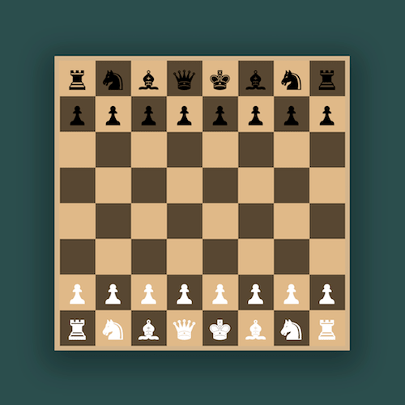

+++
title = '国际象棋'
date = 2018-06-17T17:07:48+08:00
image = '/test-hugo-deploy/img/thumbs/054.png'
summary = '#54'
+++



## 效果预览

点击链接可以在 Codepen 预览。

[https://codepen.io/comehope/pen/WyXrjz](https://codepen.io/comehope/pen/WyXrjz)

## 可交互视频

此视频是可以交互的，你可以随时暂停视频，编辑视频中的代码。

[https://scrimba.com/p/pEgDAM/czVVNtd](https://scrimba.com/p/pEgDAM/czVVNtd)

## 源代码下载

每日前端实战系列的全部源代码请从 github 下载：

[https://github.com/comehope/front-end-daily-challenges](https://github.com/comehope/front-end-daily-challenges)

## 代码解读

定义 dom，一共 8 个列表，每个列表包含 8 个元素：
```html
<div class="chess">
	<ul>
		<li></li><li></li><li></li><li></li>
		<li></li><li></li><li></li><li></li>
	</ul>

	<ul>
		<li></li><li></li><li></li><li></li>
		<li></li><li></li><li></li><li></li>
	</ul>

	<ul>
		<li></li><li></li><li></li><li></li>
		<li></li><li></li><li></li><li></li>
	</ul>

	<ul>
		<li></li><li></li><li></li><li></li>
		<li></li><li></li><li></li><li></li>
	</ul>

	<ul>
		<li></li><li></li><li></li><li></li>
		<li></li><li></li><li></li><li></li>
	</ul>

	<ul>
		<li></li><li></li><li></li><li></li>
		<li></li><li></li><li></li><li></li>
	</ul>

	<ul>
		<li></li><li></li><li></li><li></li>
		<li></li><li></li><li></li><li></li>
	</ul>

	<ul>
		<li></li><li></li><li></li><li></li>
		<li></li><li></li><li></li><li></li>
	</ul>
</div>
```

居中显示：
```css
body {
	margin: 0;
	height: 100vh;
	display: flex;
	align-items: center;
	justify-content: center;
	background-color: darkslategray;
}
```

定义容器的背景色和尺寸（由字号决定尺寸）：
```css
.chess {
	background-color: burlywood;
	font-size: 32px;
}
```

画出网格状棋盘：
```css
ul {
	display: table;
	margin: 0;
	padding: 0;
}

li {
	display: table-cell;
	width: 1.5em;
	height: 1.5em;
}
```

设置网格交错的颜色：
```css
ul:nth-child(odd) li:nth-child(even),
ul:nth-child(even) li:nth-child(odd) {
	background-color: rgba(0, 0, 0, 0.6);
}
```

在棋盘上安放棋子：
```html
<div class="chess">
	<ul>
		<li>&#9820;</li>
		<li>&#9822;</li>
		<li>&#9821;</li>
		<li>&#9819;</li>
		<li>&#9818;</li>
		<li>&#9821;</li>
		<li>&#9822;</li>
		<li>&#9820;</li>
	</ul>

	<ul>
		<li>&#9823;</li>
		<li>&#9823;</li>
		<li>&#9823;</li>
		<li>&#9823;</li>
		<li>&#9823;</li>
		<li>&#9823;</li>
		<li>&#9823;</li>
		<li>&#9823;</li>
	</ul>

	<ul>
		<li></li><li></li><li></li><li></li>
		<li></li><li></li><li></li><li></li>
	</ul>

	<ul>
		<li></li><li></li><li></li><li></li>
		<li></li><li></li><li></li><li></li>
	</ul>

	<ul>
		<li></li><li></li><li></li><li></li>
		<li></li><li></li><li></li><li></li>
	</ul>

	<ul>
		<li></li><li></li><li></li><li></li>
		<li></li><li></li><li></li><li></li>
	</ul>

	<ul>
		<li>&#9823;</li>
		<li>&#9823;</li>
		<li>&#9823;</li>
		<li>&#9823;</li>
		<li>&#9823;</li>
		<li>&#9823;</li>
		<li>&#9823;</li>
		<li>&#9823;</li>
	</ul>

	<ul>
		<li>&#9820;</li>
		<li>&#9822;</li>
		<li>&#9821;</li>
		<li>&#9819;</li>
		<li>&#9818;</li>
		<li>&#9821;</li>
		<li>&#9822;</li>
		<li>&#9820;</li>
	</ul>
</div>
```

设置棋子的颜色：
```css
ul:nth-child(-n+2) {
	color: black;
}

ul:nth-child(n+7) {
	color: white;
}
```

最后，为棋盘增加一点立体效果：
```css
.chess {
	border: 0.2em solid tan;
	box-shadow: 0 0.3em 2em 0.4em rgba(0, 0, 0, 0.3);
}
```

大功告成！
