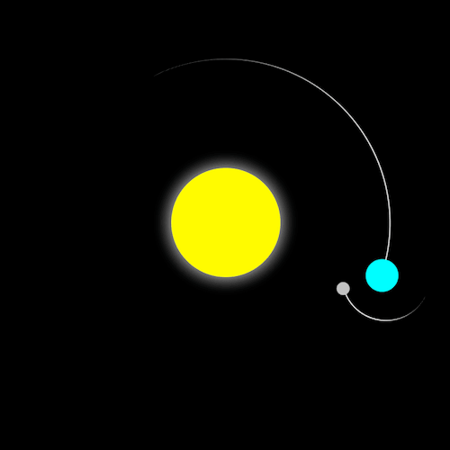

+++
title = '太阳、地球、月亮模型'
date = 2018-06-18T17:08:05+08:00
image = '/fe/img/thumbs/055.png'
summary = '#55'
+++



## 效果预览

点击链接可以在 Codepen 预览。

[https://codepen.io/comehope/pen/RJjQYY](https://codepen.io/comehope/pen/RJjQYY)

## 可交互视频

此视频是可以交互的，你可以随时暂停视频，编辑视频中的代码。

[https://scrimba.com/p/pEgDAM/cLQLyTR](https://scrimba.com/p/pEgDAM/cLQLyTR)

## 源代码下载

每日前端实战系列的全部源代码请从 github 下载：

[https://github.com/comehope/front-end-daily-challenges](https://github.com/comehope/front-end-daily-challenges)

## 代码解读

定义dom，容器中包含 3 个元素：
```html
<div class="container">
	<div class="sun"></div>
	<div class="earth">
		<div class="moon"></div>
	</div>
</div>
```

居中显示：
```css
body {
	margin: 0;
	height: 100vh;
	display: flex;
	align-items: center;
	justify-content: center;
	background-color: black;
}
```

定义容器尺寸：
```css
.container {
	font-size: 10px;
	width: 40em;
	height: 40em;
	position: relative;
}
```

画出太阳：
```css
.sun {
	position: absolute;
	top: 15em;
	left: 15em;
	width: 10em;
	height: 10em;
	background-color: yellow;
	border-radius: 50%;
	box-shadow: 0 0 3em white;
}
```

画出地球和月球的轨迹：
```css
.earth,
.moon  {
	position: absolute;
	border-style: solid;
	border-color: white transparent transparent transparent;
	border-width: 0.1em 0.1em 0 0;
	border-radius: 50%;
}

.earth {
	top: 5em;
	left: 5em;
	width: 30em;
	height: 30em;
}

.moon {
	top:0;
	right: 0;
	width: 8em;
	height: 8em;
}
```

用伪元素画出地球和月球：
```css
.earth::before,
.moon::before {
	position: absolute;
	border-radius: 50% ; 
  content: '';
}

.earth::before {
	top: 2.8em;
	right: 2.5em;
	height: 3em;
	width: 3em;
	background-color: aqua;
}

.moon::before {
	top: 0.8em;
	right: 0.2em; 
	width: 1.2em;
	height: 1.2em;
	background-color: silver;
}
```

设置运转动画效果：
```css
/* rotation period 365.2422 days */
.earth {
    animation: orbit 36.5s linear infinite;   
}

/* rotation period 27.322 days */
.moon {
    animation: orbit 2.7s linear infinite;
}

@keyframes orbit {
	to {
		transform: rotate(360deg);
	}
}
```

最后，隐藏可能会出现在容器外的部分：
```css
body {
    overflow: hidden;
}
```

大功告成！
