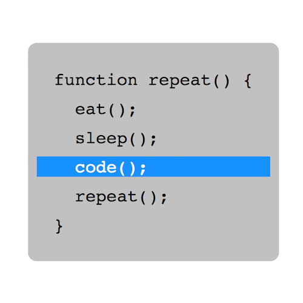

+++
title = '程序员的生活'
date = 2018-06-19T17:08:21+08:00
image = '/test-hugo-deploy/img/thumbs/056.png'
summary = '#56'
+++



## 效果预览

点击链接可以在 Codepen 预览。

[https://codepen.io/comehope/pen/YvYVvY](https://codepen.io/comehope/pen/YvYVvY)

## 可交互视频

此视频是可以交互的，你可以随时暂停视频，编辑视频中的代码。

[https://scrimba.com/p/pEgDAM/cN6L9SZ](https://scrimba.com/p/pEgDAM/cN6L9SZ)

## 源代码下载

每日前端实战系列的全部源代码请从 github 下载：

[https://github.com/comehope/front-end-daily-challenges](https://github.com/comehope/front-end-daily-challenges)

## 代码解读

定义 dom，容器中包含 6 个段落，每个段落 1 行代码：
```html
<div class="code">
	<p>function repeat() {</p>
	<p>  eat();</p>
	<p>  sleep();</p>
	<p>  code();</p>
	<p>  repeat();</p>
	<p>}</p>
</div>
```

居中显示：
```css
body {
  margin: 0;
  height: 100vh;
  display: flex;
  align-items: center;
  justify-content: center;
}
```

代码布局：
```css
.code {
	background-color: silver;
	padding: 1em 0;
	font-size: 24px;
	font-family: monospace;
	border-radius: 0.5em;
}

.code p {
	white-space: pre;
	padding: 0 1em;
	margin: 0.5em;
}
```

定义动画：
```css
.code p:not(:last-child) {
	animation: step 2s infinite;
}

@keyframes step {
	0%, 25% {
		color: white;
		background-color: dodgerblue;
	}

	26%, 100% {
		color: black;
		background-color: transparent;
	}
}

```

设置动画延时，描述单步执行的场景：
```css
.code p:not(:last-child) {
	animation-delay: var(--d);
}

.code p:nth-child(2) {
	--d: 0s;
}

.code p:nth-child(3) {
	--d: 0.5s;
}

.code p:nth-child(4) {
	--d: 1s;
}

.code p:nth-child(1),
.code p:nth-child(5) {
	--d: 1.5s;
}
```

大功告成！
