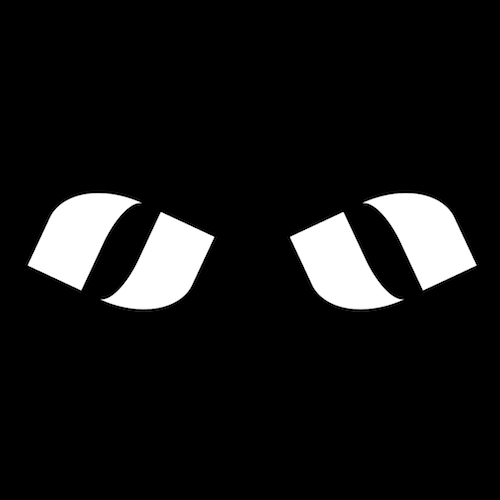

+++
title = '黑暗中眼睛'
date = 2018-06-20T17:08:35+08:00
image = '/test-hugo-deploy/img/thumbs/057.png'
summary = '#57'
+++



## 效果预览

点击链接可以在 Codepen 预览。

[https://codepen.io/comehope/pen/xzYVzO](https://codepen.io/comehope/pen/xzYVzO)

## 可交互视频

此视频是可以交互的，你可以随时暂停视频，编辑视频中的代码。

[https://scrimba.com/p/pEgDAM/cRkRLsm](https://scrimba.com/p/pEgDAM/cRkRLsm)

## 源代码下载

每日前端实战系列的全部源代码请从 github 下载：

[https://github.com/comehope/front-end-daily-challenges](https://github.com/comehope/front-end-daily-challenges)

## 代码解读

定义 dom，容器中包含 2 个元素：
```html
<div class="eyes">
	<span class="left"></span>
	<span class="right"></span>
</div>
```

居中显示：
```css
body {
	margin: 0;
	height: 100vh;
	display: flex;
	align-items: center;
	justify-content: center;
	background-color: black;
}
```

定义容器尺寸：
```css
.eyes {
	width: 40em;
	height: 10em;
	font-size: 10px;
}
```

画出眼睛的轮廓：
```css
.eyes {
	position: relative;
}

.eyes > * {
	box-sizing: border-box;
	position: absolute;
	width: 15em;
	height: 10em;
	border: solid white;
}

.eyes .left {
	left: 0;
}

.eyes .right {
	right: 0;
}
```

画出眼球：
```css
.eyes > * {
	border-width: 0 5em;
}

.eyes .left {
	border-radius: 50% 0;
}

.eyes .right {
	border-radius: 0 50%;
}
```

使双眼向内聚拢：
```css
.eyes .left {
	transform: rotate(25deg);
}

.eyes .right {
	transform: rotate(-25deg);
}
```

定义眨眼的动画：
```css
@keyframes blink {
	40%, 60% {
		border-width: 0 5em;
	}

	50% {
		border-width: 0 7.5em;
	}
}
```

最后，把动画效果应用到两只眼睛上：
```css
.eyes > * {
	animation: blink 2s linear infinite;
}
```

大功告成！
