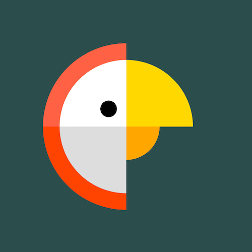

+++
title = '鹦鹉'
date = 2018-06-21T17:08:50+08:00
image = '/test-hugo-deploy/img/thumbs/058.png'
summary = '#58'
+++



## 效果预览

点击链接可以在 Codepen 预览。

[https://codepen.io/comehope/pen/vrRmWy](https://codepen.io/comehope/pen/vrRmWy)

## 可交互视频

此视频是可以交互的，你可以随时暂停视频，编辑视频中的代码。

[https://scrimba.com/p/pEgDAM/c7adzTW](https://scrimba.com/p/pEgDAM/c7adzTW)

## 源代码下载

每日前端实战系列的全部源代码请从 github 下载：

[https://github.com/comehope/front-end-daily-challenges](https://github.com/comehope/front-end-daily-challenges)

## 代码解读

定义 dom，容器中包含 3 个子元素：
```html
<div class="parrot">
	<div class="outer"></div>
	<div class="middle"></div>
	<div class="inner"></div>
</div>
```

居中显示：
```css
body {
	margin: 0;
	height: 100vh;
	display: flex;
	align-items: center;
	justify-content: center;
	background-color: darkslategray;
}
```

定义容器尺寸：
```css
.parrot {
	width: 10em;
	height: 10em;
	font-size: 30px;
}
```

画出鹦鹉头部的羽毛：
```css
.parrot {
	position: relative;
	display: flex;
	align-items: center;
	justify-content: center;
}

.parrot .outer {
	position: absolute;
	width: 100%;
	height: 100%;
	border: 1em solid;
	border-color: transparent transparent orangered tomato;
	border-radius: 50%;
}
```

画出鹦鹉的头部和喙的上半部分：
```css
.parrot .middle {
	position: absolute;
	width: 80%;
	height: 80%;
	border: 4em solid;
	border-color: gold transparent gainsboro white;
	border-radius: 50%;
}
```

画出鹦鹉的喙的下半部分：
```css
.parrot .inner {
	position: absolute;
	width: 40%;
	height: 40%;
	border: 2em solid;
	border-color: transparent orange transparent transparent;
	border-radius: 50%;
}
```

用伪元素画出鹦鹉的眼睛：
```css
.parrot .inner::before {
	content: '';
	position: absolute;
	width: 1em;
	height: 1em;
	background-color: black;
	border-radius: 50%;
	left: -2em;
	top: -0.5em;
}
```

把画面转正：
```css
.parrot > * {
	transform: rotate(45deg);
}
```

设置鼠标悬停效果，悬停时鹦鹉的头转向另一侧：
```css
.parrot > * {
	transition: 0.5s;
}

.parrot:hover .outer {
	transform: rotate(225deg);
	border-color: transparent transparent tomato orangered;
}

.parrot:hover .middle {
	transform: rotate(calc(225deg - 360deg));
	border-color: transparent gold white gainsboro;
}

.parrot:hover .inner {
	transform: rotate(135deg);
}
```

最后，修改悬停时鹦鹉的配色：
```css
.parrot:hover .outer {
	border-color: transparent transparent lightseagreen darkcyan;
}

.parrot:hover .middle {
	border-color: transparent gold white gainsboro;
}

.parrot:hover .inner {
	border-color: transparent orange transparent transparent;
}
```

大功告成！
