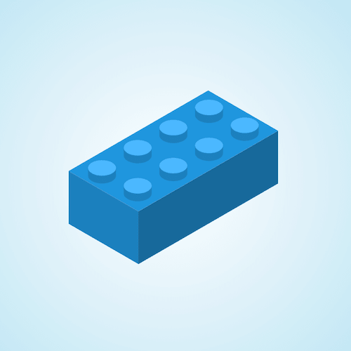

+++
title = '乐高积木块'
date = 2018-06-24T17:09:21+08:00
image = '/fe/img/thumbs/060.png'
summary = '#60'
+++



## 效果预览

点击链接可以在 Codepen 预览。

[https://codepen.io/comehope/pen/qKKqrv](https://codepen.io/comehope/pen/qKKqrv)

## 可交互视频

此视频是可以交互的，你可以随时暂停视频，编辑视频中的代码。

[https://scrimba.com/p/pEgDAM/cWm3Vub](https://scrimba.com/p/pEgDAM/cWm3Vub)

## 源代码下载

每日前端实战系列的全部源代码请从 github 下载：

[https://github.com/comehope/front-end-daily-challenges](https://github.com/comehope/front-end-daily-challenges)

## 代码解读

定义 dom，容器中包含一组 3 个面：
```html
<div class="brick">
	<div class="sides">
		<span class='front'></span>
		<span class='right'></span>
		<span class="top"></span>
	</div>
</div>
```

居中显示：
```css
body {
	margin: 0;
	height: 100vh;
	display: flex;
	align-items: center;
	justify-content: center;
	background: radial-gradient(circle at center, white, skyblue);
}
```

定义容器尺寸：
```css
.brick {
	width: 40em;
	height: 30em;
	font-size: 10px;
}
```

画出积木的正面：
```css
.brick {
	position: relative;
}

.sides .front {
	position: absolute;
	width: 9em;
	height: 6.8em;
	background-color: #237fbd;
	top: 19em;
	left: 7em;
}
```

画出积木的右面：
```css
.sides > * {
	position: absolute;
	background-color: #237fbd;
}

.sides .right {
	width: 18em;
	height: 6.8em;
	filter: brightness(0.8);
	top: 19em;
	left: calc(7em + 9em);
}
```

画出积木的顶面：
```css
.sides .top {
	width: 18em;
	height: 10.4em;
	filter: brightness(1.2);
	top: calc(19em - 10.4em);
	left: calc(7em + 9em);
}
```

把以上 3 个面组合成立方体：
```css
.sides .front {
	transform-origin: right;
	transform: skewY(30deg);
}

.sides .right {
	transform-origin: left;
	transform: skewY(-30deg);
}

.sides .top {
	transform-origin: left bottom;
	transform: rotate(-60deg) skewY(30deg);
}
```

接下来画积木的凸粒。

在 dom 中增加 8 个凸粒元素：
```html
<div class="brick">
	<div class="sides">
		<span class='front'></span>
		<span class='right'></span>
		<span class="top"></span>
	</div>
	<div class="studs">
		<span></span>
		<span></span>
		<span></span>
		<span></span>
		<span></span>
		<span></span>
		<span></span>
		<span></span>
	</div>
</div>
```

定义变量：
```css
.studs span:nth-child(1) {
	--n: 1;
}

.studs span:nth-child(3) {
	--n: 3;
}

.studs span:nth-child(5) {
	--n: 5;
}

.studs span:nth-child(7) {
	--n: 7;
}

.studs span:nth-child(2) {
	--n: 2;
}

.studs span:nth-child(4) {
	--n: 4;
}

.studs span:nth-child(6) {
	--n: 6;
}

.studs span:nth-child(8) {
	--n: 8;
}
```

画出左侧的凸粒：
```css
.studs span:nth-child(odd) {
	top: calc(4.6em + (var(--n) - 1) / 2 * 2.6em);
	left: calc(23.3em - (var(--n) - 1) / 2 * 4.6em);
}
```

画出右侧的凸粒：
```css
.studs span:nth-child(even) {
	top: calc(6.9em + (var(--n) - 2) / 2 * 2.6em);
	left: calc(27.9em - (var(--n) - 2) / 2 * 4.6em);
}
```

最后，画出凸粒的顶面：
```css
.studs span::before {
	content: '';
	position: absolute;
	width: inherit;
	height: 2em;
	background-color: #4cb7ff;
	border-radius: 50%;
}
```

大功告成！
