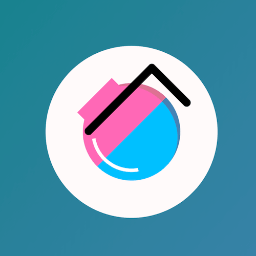

+++
title = '咖啡壶'
date = 2018-06-25T17:09:37+08:00
image = '/test-hugo-deploy/img/thumbs/061.png'
summary = '#61'
+++



## 效果预览

点击链接可以在 Codepen 预览。

[https://codepen.io/comehope/pen/ZRjGGy](https://codepen.io/comehope/pen/ZRjGGy)

## 可交互视频

此视频是可以交互的，你可以随时暂停视频，编辑视频中的代码。

[https://scrimba.com/p/pEgDAM/cLQPgSE](https://scrimba.com/p/pEgDAM/cLQPgSE)

## 源代码下载

每日前端实战系列的全部源代码请从 github 下载：

[https://github.com/comehope/front-end-daily-challenges](https://github.com/comehope/front-end-daily-challenges)

## 代码解读

定义 dom，容器中包含 1 个元素表示壶体，其中再包含 1 个元素表示壶把手：
```html
<div class="container">
  	<div class="pot">
  		<div class="handle"></div>
  	</div>
</div>
```

居中显示：
```css
body {
	margin: 0;
	height: 100vh;
	display: flex;
	align-items: center;
	justify-content: center;
	background: linear-gradient(to right bottom, silver, dimgray);
}
```

重定义盒模型：
```css
*,
*::before,
*::after {
	box-sizing: border-box;
}
```

定义容器尺寸：
```css
.container {
	width: 150px;
	height: 150px;
	background-color: snow;
	border-radius: 50%;
}
```

画出壶的最大的部分：
```css
.container {
	display: flex;
	align-items: center;
	justify-content: center;
}

.pot {
	width: 85px;
	height: 85px;
	background-color: deepskyblue;
	border-radius: 50%;
}
```

用伪元素画出壶的上半部分：
```css
.pot {
	position: relative;
}

.pot::before {
	content: '';
	position: absolute;
	width: 85px;
	height: 43px;
	background-color: hotpink;
	border-radius: 43px 43px 0 0;
}
```

用伪元素画出壶嘴：
```css
.pot::after {
	content: '';
	position: absolute;
	width: 43px;
	height: 10px;
	background-color: hotpink;
	left: 21px;
	top: -3px;
}
```

画出把手横向的部分：
```css
.pot .handle {
	width: 83px;
	height: 7px;
	background-color: black;
	border-radius: 7px;
	position: absolute;
	left: 13px;
	top: 12px;
}
```

用伪元素画出把手竖向的部分：
```css
.pot .handle::before {
	content: '';
	position: absolute;
	width: 7px;
	height: 50px;
	background-color: black;
	border-radius: 7px;
	left: calc(85px - 7px);
}
```

接下来润色一下。

给壶加上阴影：
```css
.pot {
	border-right: 5px solid steelblue;
}

.pot::before {
	border-right: 5px solid palevioletred;
}
```

再用伪元素给壶加上光影：
```css
.container::after {
	content: '';
	position: absolute;
	width: 70px;
	height: 70px;
	border: 3px solid transparent;
	border-left-color: white;
	border-radius: 50%;
	left: 40px;
	top: 40px;
	transform: rotate(-10deg);
}
```

最后，加上动画：
```css
.container {
	animation: pouring 3s linear infinite alternate;
}

@keyframes pouring {
	0%, 25% {
		transform: rotate(0deg);
	}

	75%, 100% {
		transform: rotate(-45deg);
	}
}
```

大功告成！
