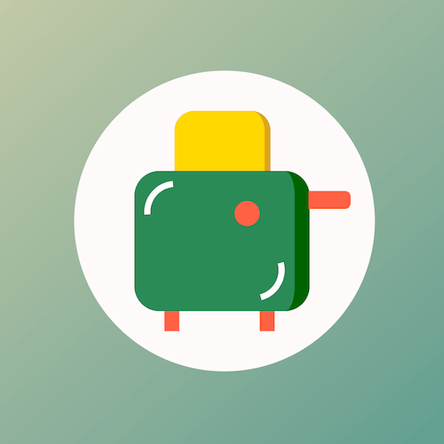

+++
title = '烤面包机'
date = 2018-06-27T17:10:07+08:00
image = '/test-hugo-deploy/img/thumbs/063.png'
summary = '#63'
+++

## 效果预览



点击链接可以在 Codepen 预览。

[https://codepen.io/comehope/pen/OEBJRN](https://codepen.io/comehope/pen/OEBJRN)

## 可交互视频

此视频是可以交互的，你可以随时暂停视频，编辑视频中的代码。

[https://scrimba.com/p/pEgDAM/c6bkqT2](https://scrimba.com/p/pEgDAM/c6bkqT2)

## 源代码下载

每日前端实战系列的全部源代码请从 github 下载：

[https://github.com/comehope/front-end-daily-challenges](https://github.com/comehope/front-end-daily-challenges)

## 代码解读

定义 dom，容器中包含 5 个元素，分别代表机体、按钮、支腿、手柄和面包。
```html
<div class="toaster">
	<div class="body"></div>
	<div class="button"></div>
	<div class="legs"></div>
	<div class="handle"></div>
	<div class="toast"></div>
</div>
```

居中显示：
```css
body {
	margin: 0;
	height: 100vh;
	display: flex;
	align-items: center;
	justify-content: center;
	background: linear-gradient(to right bottom, moccasin, teal);
}
```

定义容器尺寸：
```css
.toaster {
	width: 30em;
	height: 30em;
	background-color: snow;
	font-size: 10px;
	border-radius: 50%;
}
```

画出机体：
```css
.toaster {
	position: relative;
}

.body {
	width: 16em;
	height: 14em;
	background-color: seagreen;
	position: absolute;
	top: 10em;
	left: 6em;
	border-radius: 2.5em;
	border-right: 1.5em solid darkgreen;
}
```

画出按钮：
```css
.button {
	width: 2.5em;
	height: 2.5em;
	background-color: tomato;
	position: absolute;
	top: 13em;
	left: 16em;
	border-radius: 50%;
}
```

画出支腿：
```css
.legs::before,
.legs::after {
	content: '';
	position: absolute;
	width: 1.5em;
	height: 2em;
	background: tomato;
	top: 24em;
}

.legs::before {
	left: 9em;
}

.legs::after {
	right: 10em;
}
```

画出手柄：
```css
.handle {
	width: 4.2em;
	height: 1.8em;
	background-color: tomato;
	position: absolute;
	top: 12em;
	right: 2.4em;
	border-radius: 0 0.6em 0.6em 0;
}
```

画出面包：
```css
.toaster {
	z-index: 1;
}

.toast {
	width: 9em;
	height: 6em;
	background-color: gold;
	position: absolute;
	top: 4em;
	left: 10em;
	border-radius: 2em 2em 0 0;
	border-right: 0.6em solid goldenrod;
	z-index: -1;
}
```

为机体增加一些光影：
```css
.body::before,
.body::after {
	content: '';
	position: absolute;
	width: 5em;
	height: 5em;
	border: 0.6em solid transparent;
	border-radius: 50%;
	border-left-color: white;
}

.body::before {
	transform: rotate(40deg);
	top: 1em;
	left: 1em;
}

.body::after {
	bottom: 1em;
	right: 1em;
	transform: rotate(210deg);
}
```

定义动画效果：
```css
@keyframes bake {
	0%, 20% {
		transform: translateY(0);
	}

	80%, 100% {
		transform: translateY(6em);
	}
}
```

最后，把动画效果应用到手柄和面包上：
```css
.handle {
	animation: bake 3s infinite alternate;
}

.toast {
	animation: bake 3s infinite alternate;
}
```

大功告成！
