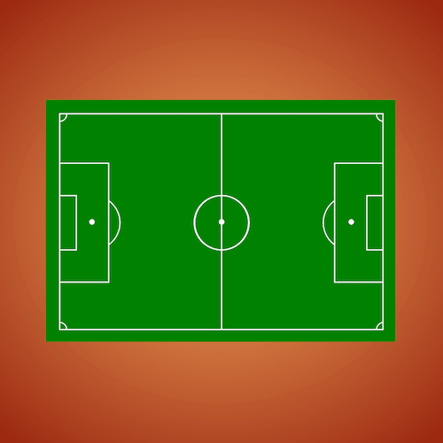

+++
title = '足球场'
date = 2018-06-28T17:10:23+08:00
image = '/fe/img/thumbs/064.png'
summary = '#64'
+++



## 效果预览

点击链接可以在 Codepen 预览。

[https://codepen.io/comehope/pen/BVqXwJ](https://codepen.io/comehope/pen/BVqXwJ)

## 可交互视频

此视频是可以交互的，你可以随时暂停视频，编辑视频中的代码。

[https://scrimba.com/p/pEgDAM/cKbw4Tg](https://scrimba.com/p/pEgDAM/cKbw4Tg)

## 源代码下载

每日前端实战系列的全部源代码请从 github 下载：

[https://github.com/comehope/front-end-daily-challenges](https://github.com/comehope/front-end-daily-challenges)

## 代码解读

定义 dom，容器中包含场地，场地中再包含中线、中点、中圈、禁区、罚球点、罚球弧、球门区、角球区等元素：
```html
<div class="container">
	<div class="field">
		<span class="halfway-line"></span>
		<span class="centre-circle"></span>
		<span class="centre-mark"></span>
		<span class="penalty-area"></span>
		<span class="penalty-mark"></span>
		<span class="penalty-arc"></span>
		<span class="goal-area"></span>
		<span class="corner-arc"></span>
	</div>
</div>
```

居中显示：
```css
body {
	margin: 0;
	height: 100vh;
	display: flex;
	align-items: center;
	justify-content: center;
	background: radial-gradient(sandybrown, maroon);
}
```

定义容器尺寸：
```css
.container {
	width: 120em;
	height: 80em;
	background-color: green;
	font-size: 5px;
}

.container span {
	display: block;
}
```

定义线型：
```css
.container {
	--line: 0.3em solid white;
}
```

画出场地边线：
```css
.container {
	padding: 5em;
}

.field {
	width: inherit;
	height: inherit;
	border: var(--line);
}
```

画出中线：
```css
.halfway-line {
	width: calc(120em / 2);
	height: 80em;
	border-right: var(--line);
}
```

画出中圈：
```css
.field {
	position: relative;
}

.centre-circle {
	width: 20em;
	height: 20em;
	border: var(--line);
	border-radius: 50%;
	position: absolute;
	top: calc((80em - 20em) / 2);
	left: calc((120em - 20em - 0.3em) / 2);
}
```

画出中点：
```css
.centre-mark {
	width: 2em;
	height: 2em;
	background-color: white;
	border-radius: 50%;
	position: absolute;
	top: calc(80em / 2 - 1em);
	left: calc(120em / 2 - 1em + 0.3em / 2);
}
```

画出禁区：
```css
.penalty-area {
	width: 18em;
	height: 44em;
	border: var(--line);
	position: absolute;
	top: calc((80em - 44em) / 2);
	left: -0.3em;
}
```

画出罚球点：
```css
.penalty-mark {
	width: 2em;
	height: 2em;
	background-color: white;
	border-radius: 50%;
	position: absolute;
	top: calc(80em / 2 - 1em);
	left: calc(12em - 1em);
}
```

画出罚球弧：
```css
.penalty-arc {
	width: 20em;
	height: 20em;
	border: var(--line);
	border-radius: 50%;
	position: absolute;
	top: calc((80em - 20em) / 2);
	left: calc(12em - 20em / 2);
}
```

隐藏罚球弧左侧弧线，只留右侧弧线：
```css
.field {
	z-index: 1;
}

.penalty-area {
	background-color: green;
}

.penalty-arc {
	z-index: -1;
}
```

画出球门区：
```css
.goal-area {
	width: 6em;
	height: 20em;
	border: var(--line);
	position: absolute;
	top: calc((80em - 20em) / 2);
	left: -0.3em;
}
```

画出角球区：
```css
.field {
	overflow: hidden;
}

.corner-arc::before,
.corner-arc::after {
	content: '';
	position: absolute;
	width: 5em;
	height: 5em;
	border: 0.3em solid white;
	border-radius: 50%;
	--offset: calc(-5em / 2 - 0.3em);
	left: var(--offset);
}

.corner-arc::before {
	top: var(--offset);
}

.corner-arc::after {
	bottom: var(--offset);
}
```

把 dom 中的子元素复制出一份，左右两侧各一份：
```html
<div class="container">
	<div class="field">
		<div class="left">
			<span class="halfway-line"></span>
			<span class="centre-circle"></span>
			<span class="centre-mark"></span>
			<span class="penalty-area"></span>
			<span class="penalty-mark"></span>
			<span class="penalty-arc"></span>
			<span class="goal-area"></span>
			<span class="corner-arc"></span>
		</div>
		<div class="right">
			<span class="halfway-line"></span>
			<span class="centre-circle"></span>
			<span class="centre-mark"></span>
			<span class="penalty-area"></span>
			<span class="penalty-mark"></span>
			<span class="penalty-arc"></span>
			<span class="goal-area"></span>
			<span class="corner-arc"></span>
		</div>
	</div>
</div>
```

右侧的样式与左侧相同，只需要水平翻转即可：
```css
.right {
	position: absolute;
	top: 0;
	left: 50%;
	transform: rotateY(180deg);
}
```

大功告成！
