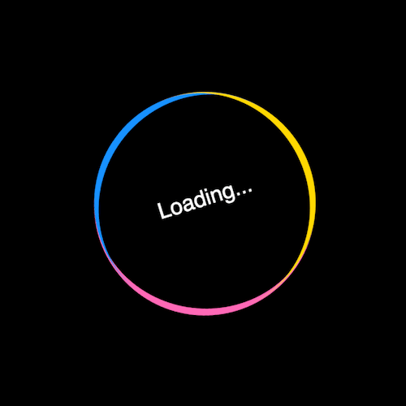

+++
title = '摇晃的 loader'
date = 2018-06-29T17:10:41+08:00
image = '/test-hugo-deploy/img/thumbs/065.png'
summary = '#65'
+++



## 效果预览

点击链接可以在 Codepen 预览。

[https://codepen.io/comehope/pen/oyJvpe](https://codepen.io/comehope/pen/oyJvpe)

## 可交互视频

此视频是可以交互的，你可以随时暂停视频，编辑视频中的代码。

[https://scrimba.com/p/pEgDAM/cqwpQh7](https://scrimba.com/p/pEgDAM/cqwpQh7)

## 源代码下载

每日前端实战系列的全部源代码请从 github 下载：
[https://github.com/comehope/front-end-daily-challenges](https://github.com/comehope/front-end-daily-challenges)

## 代码解读

定义 dom，容器中包含一个子元素，子元素内是文字：
```html
<div class="loader">
    <span>Loading...</span>
</div>
```

居中显示：
```css
body {
    margin: 0;
    height: 100vh;
    display: flex;
    align-items: center;
    justify-content: center;
    background-color: black;
}
```

定义容器尺寸：
```css
.loader {
    width: 10em;
    height: 10em;
    font-size: 30px;
    box-sizing: border-box;
}
```

设置文字样式：
```css
.loader span {
    position: absolute;
    color: white;
    width: inherit;
    height: inherit;
    text-align: center;
    line-height: 10em;
    font-family: sans-serif;
}
```

画出组成圆的顶部弧线：
```css
.loader {
    border-top: 0.3em solid hotpink;
    border-radius: 50%;
}
```

用伪元素画出组成圆的另外 2 条弧线：
```css
.loader {
    position: relative;
}

.loader::before,
.loader::after {
    content: '';
    position: absolute;
    width: inherit;
    height: inherit;
    border-radius: 50%;
    box-sizing: border-box;
    top: -0.2em;
}

.loader::before {
    border-top: 0.3em solid dodgerblue;
    transform: rotate(120deg);
}

.loader::after {
    border-top: 0.3em solid gold;
    transform: rotate(240deg);
}
```

定义动画效果：
```css
@keyframes rotating {
    50% {
        transform: rotate(calc(180deg * var(--direction)));
    }

    100% {
        transform: rotate(calc(360deg * var(--direction)));
    }
}
```

把动画效果应用到圆上：
```css
.loader {
    animation: rotating 2s ease-in-out infinite;
    --direction: 1;
}
```

把动画效果应用到文字上：
```css
.loader span {
    animation: rotating 2s linear infinite;
    --direction: -1;
}
```

最后，隐藏可能超出窗口的内容：
```css
body {
    overflow: hidden;
}
```

大功告成！
