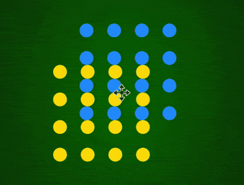

+++
title = '点阵 loader'
date = 2018-07-02T17:11:20+08:00
tags = ['']
image = '/test-hugo-deploy/img/thumbs/067.png'
summary = '#67'
+++



## 效果预览

点击链接可以在 Codepen 预览。

[https://codepen.io/comehope/pen/YvBvBr](https://codepen.io/comehope/pen/YvBvBr)

## 可交互视频

此视频是可以交互的，你可以随时暂停视频，编辑视频中的代码。

[https://scrimba.com/p/pEgDAM/cwE7NCm](https://scrimba.com/p/pEgDAM/cwE7NCm)

## 源代码下载

每日前端实战系列的全部源代码请从 github 下载：

[https://github.com/comehope/front-end-daily-challenges](https://github.com/comehope/front-end-daily-challenges)

## 代码解读

定义 dom，只有 1 个元素：
```html
<div class="loader"></div>
```

居中显示：
```css
body {
    margin: 0;
    height: 100vh;
    display: flex;
    align-items: center;
    justify-content: center;
    background: radial-gradient(darkgreen 30%, forestgreen);
}
```

定义容器尺寸：
```css
.loader {
    width: 10em;
    height: 10em;
    font-size: 20px;
}
```

用 box-shadow 画出 2 组点阵：
```css
.loader::before,
.loader::after {
    content: '';
    position: absolute;
    width: 1em;
    height: 1em;
    background-color: currentColor;
    box-shadow:
        0 0, 2em 0, 4em 0, 6em 0,
        0 2em, 2em 2em, 4em 2em, 6em 2em,
        0 4em, 2em 4em, 4em 4em, 6em 4em,
        0 6em, 2em 6em, 4em 6em, 6em 6em;
    border-radius: 50%;
}

.loader::before {
    color: gold;
}

.loader::after {
    color: dodgerblue;
}
```

定义动画：
```css
@keyframes round {
    0% {
        transform: translateX(0) translateY(0);
    }

    25% {
        transform: translateX(3em) translateY(0);
    }

    50% {
        transform: translateX(3em) translateY(3em);
    }

    75% {
        transform: translateX(0) translateY(3em);
    }
}
```

最后，把动画效果应用到点阵上：
```css
.loader::before,
.loader::after {
    animation: round 2s ease infinite;
}

.loader::after {
    animation-delay: -1s;
}
```

大功告成！
