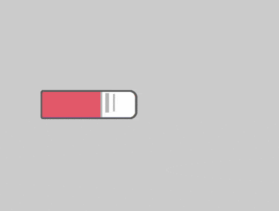

+++
title = '色卡'
date = 2018-07-03T17:11:40+08:00
image = '/test-hugo-deploy/img/thumbs/068.png'
summary = '#68'
+++



## 效果预览

点击链接可以在 Codepen 预览。

[https://codepen.io/comehope/pen/LraOXQ](https://codepen.io/comehope/pen/LraOXQ)

## 可交互视频

此视频是可以交互的，你可以随时暂停视频，编辑视频中的代码。

[https://scrimba.com/p/pEgDAM/cQv6NhD](https://scrimba.com/p/pEgDAM/cQv6NhD)

## 源代码下载

每日前端实战系列的全部源代码请从 github 下载：

[https://github.com/comehope/front-end-daily-challenges](https://github.com/comehope/front-end-daily-challenges)

## 代码解读

定义 dom，容器中包含 8 个元素：
```html
<div class="cards">
    <span></span>
    <span></span>
    <span></span>
    <span></span>
    <span></span>
    <span></span>
    <span></span>
    <span></span>
</div>
```

居中显示：
```css
body {
    margin: 0;
    height: 100vh;
    display: flex;
    align-items: center;
    justify-content: center;
    background-color: lightgray;
}
```

重定义盒模型：
```css
.cards,
.cards > * {
    box-sizing: border-box;
}
```

定义容器尺寸：
```css
.cards {
    width: 20em;
    height: 20em;
}
```

画出色卡：
```css
.cards span {
    position: absolute;
    width: 10em;
    height: 3em;
    background-color: lightgreen;
    top: calc(50% - 3em / 2);
    border: 0.2em solid dimgray;
    border-radius: 0.3em 0.8em 0.8em 0.3em;
}
```

用伪元素画出色卡的标签：
```css
.cards span::before {
    content: '';
    position: absolute;
    width: 35%;
    height: 100%;
    background-color: white;
    right: 0;
    border-radius: 0 0.6em 0.6em 0;
    border-left: 0.2em solid silver;
}
```

用伪元素画出色卡标签上的文字：
```css
.cards span::after {
    content: '';
    position: absolute;
    width: 0.4em;
    height: 2em;
    background-color: silver;
    left: 6.5em;
    top: 0.1em;
    box-shadow: 0.7em 0 0 -0.1em silver;
}
```

为色卡设置变量：
```css
.cards span:nth-child(1) {
    --n: 1;
}

.cards span:nth-child(2) {
    --n: 2;
}

.cards span:nth-child(3) {
    --n: 3;
}

.cards span:nth-child(4) {
    --n: 4;
}

.cards span:nth-child(5) {
    --n: 5;
}

.cards span:nth-child(6) {
    --n: 6;
}

.cards span:nth-child(7) {
    --n: 7;
}

.cards span:nth-child(8) {
    --n: 8;
}
```

用 HSL 色彩模式为色卡上色：
```css
.cards span {
    background-color: hsl(calc(360 / 8 * var(--n)), 80%, 70%);
}
```

定义动画效果：
```css
.cards span {
    transform-origin: right;
    animation: rotating 3s linear infinite;
}

@keyframes rotating {
    0%, 35% {
        transform: rotate(0deg);
    }

    90%, 100% {
        transform: rotate(360deg);
    }
}
```

最后，设置动画延时，让卡片依次旋转：
```css
.cards span {
    animation-delay: calc((var(--n) - 8) * 0.15s);
}
```

大功告成！
