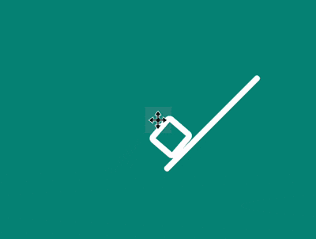

+++
title = '抛盒子 loader'
date = 2018-07-04T17:11:58+08:00
image = '/fe/img/thumbs/069.png'
summary = '#69'
+++



## 效果预览

点击链接可以在 Codepen 预览。

[https://codepen.io/comehope/pen/qKwXbx](https://codepen.io/comehope/pen/qKwXbx)

## 可交互视频

此视频是可以交互的，你可以随时暂停视频，编辑视频中的代码。

[https://scrimba.com/p/pEgDAM/cD96VUM](https://scrimba.com/p/pEgDAM/cD96VUM)

## 源代码下载

每日前端实战系列的全部源代码请从 github 下载：

[https://github.com/comehope/front-end-daily-challenges](https://github.com/comehope/front-end-daily-challenges)

## 代码解读

定义 dom，只有 1 个元素：
```html
<div id="loader"></div>
```

居中显示：
```css
body {
    margin: 0;
    height: 100vh;
    display: flex;
    align-items: center;
    justify-content: center;
    background-color: teal;
}
```

画出一根木条：
```css
.loader {
    width: 6em;
    border-bottom: 0.25em solid white;
    font-size: 30px;
    border-radius: 0.125em;
}
```

用伪元素在其上画出一个盒子：
```css
.loader {
    position: relative;
}

.loader::before {
    content: '';
    position: absolute;
    width: 1em;
    height: 1em;
    border: 0.25em solid white;
    bottom: 0;
    left: 0.5em;
    border-radius: 0.25em;
}
```

让图案倾斜，形成盒子在坡上的效果：
```css
.loader {
    transform: rotate(-45deg);
    left: 1em;
    top: 1em;
}
```

接下来制作动画。

让盒子一步步爬坡，爬到坡顶再重爬：
```css
.loader::before {
    animation: push 3s infinite;
}

@keyframes push {
    0% {
        transform: translateX(0);
    }
    
    20%, 25% {
        transform: translateX(1em);
    }

    40%, 45% {
        transform: translateX(2em);
    }

    60%, 65% {
        transform: translateX(3em);
    }

    80% {
        transform: translateX(0);
    }
}
```

增加盒子在爬坡的过程中的滚动效果：
```css
@keyframes push {
    0% {
        transform: translateX(0) rotate(0deg);
    }
    
    20%, 25% {
        transform: translateX(1em) rotate(calc(90deg * 1));
    }

    40%, 45% {
        transform: translateX(2em) rotate(calc(90deg * 2));
    }

    60%, 65% {
        transform: translateX(3em) rotate(calc(90deg * 3));
    }

    80% {
        transform: translateX(0) rotate(0deg);
    }
}
```

增加盒子在爬坡过程中的拟人效果：
```css
@keyframes push {
    0% {
        transform: translateX(0) rotate(0deg);
    }

    5% {
        transform: translateX(0) rotate(-5deg);
    }
    
    20%, 25% {
        transform: translateX(1em) rotate(calc(90deg * 1 + 5deg));
    }

    30% {
        transform: translateX(1em) rotate(calc(90deg * 1 - 5deg));
    }

    40%, 45% {
        transform: translateX(2em) rotate(calc(90deg * 2 + 5deg));
    }

    50% {
        transform: translateX(2em) rotate(calc(90deg * 2 - 5deg));
    }

    60%, 65% {
        transform: translateX(3em) rotate(calc(90deg * 3 + 5deg));
    }

    70% {
        transform: translateX(3em) rotate(calc(90deg * 3 - 5deg));
    }

    80% {
        transform: translateX(0) rotate(-5deg);
    }
}
```

让木条在箱子爬到接近顶点时做抛掷动作：
```css
.loader {
    animation: throw 3s infinite;
    transform-origin: 20%;
}

@keyframes throw {
    0%, 70%, 100% {
        transform: rotate(-45deg);
    }

    80% {
        transform: rotate(-135deg);
    }
}
```

增加盒子在爬到接近顶点时的掉落效果：
```css
@keyframes push {
    70% {
        transform: translateX(3em) translateY(0) rotate(calc(90deg * 3 - 5deg)) scale(1);
        filter: opacity(1);
    }

    80% {
        transform: translateX(0) translateY(-5em) rotate(-5deg) scale(0);
        filter: opacity(0.5);
    }

    90% {
        transform: translateX(0) translateY(0) rotate(0deg) scale(0);
    }
}
```

最后，隐藏掉可能超出页面的部分：
```css
body {
    overflow: hidden;
}
```

大功告成！
