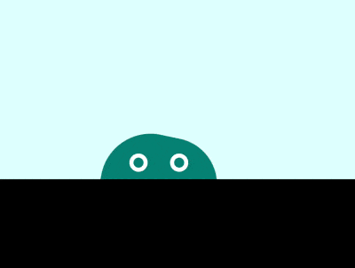

+++
title = '徘徊的果冻怪兽'
date = 2018-07-05T17:12:20+08:00
image = '/fe/img/thumbs/070.png'
summary = '#70'
+++



## 效果预览

点击链接可以在 Codepen 预览。

[https://codepen.io/comehope/pen/VdOKQG](https://codepen.io/comehope/pen/VdOKQG)

## 可交互视频

此视频是可以交互的，你可以随时暂停视频，编辑视频中的代码。

[https://scrimba.com/p/pEgDAM/c43ekUL](https://scrimba.com/p/pEgDAM/c43ekUL)

## 源代码下载

每日前端实战系列的全部源代码请从 github 下载：

[https://github.com/comehope/front-end-daily-challenges](https://github.com/comehope/front-end-daily-challenges)

## 代码解读

定义 dom，容器中包含 2 个元素，分别代表怪兽的身体和眼睛：
```html
<div class="monster">
    <span class="body"></span>
	<span class="eyes"></span>
</div>
```

设置背景色：
```css
body {
    margin: 0;
    height: 100vh;
    background-color: black;
}
```

设置前景色：
```css
.monster {
    width: 100vw;
    height: 50vh;
    background-color: lightcyan;
}
```

画出怪兽的身体：
```css
.monster {
    position: relative;
}

.body {
    position: absolute;
    width: 32vmin;
    height: 32vmin;
    background-color: teal;
    border-radius: 43% 40% 43% 40%;
    bottom: calc(-1 * 32vmin / 2 - 4vmin);
}
```

定义怪兽眼睛所在的容器：
```css
.eyes {
    width: 24vmin;
    height: 5vmin;
    position: absolute;
    bottom: 2vmin;
    left: calc(32vmin - 24vmin - 2vmin);
}
```

用伪元素画出怪兽的眼睛：
```css
.eyes::before,
.eyes::after {
    content: '';
    position: absolute;
    width: 5vmin;
    height: 5vmin;
    border: 1.25vmin solid white;
    box-sizing: border-box;
    border-radius: 50%;
}

.eyes::before {
    left: 4vmin;
}

.eyes::after {
    right: 4vmin;
}
```

为怪兽定义轻轻跳起的动画，结合后面的动画效果，让它具有果冻的弹性：
```css
.body {
    animation:
        bounce 1s infinite alternate;
}

@keyframes bounce {
    to {
        bottom: calc(-1 * 32vmin / 2 - 2vmin);
    }
}
```

让怪兽的身体转动起来：
```css
@keyframes wave {
    to {
        transform: rotate(360deg);
    }
}
```

让怪兽徘徊行走：
```css
.monster {
    overflow: hidden;
}

.body {
    left: -2vmin;
    animation:
        wander 5s linear infinite alternate,
        wave 3s linear infinite,
        bounce 1s infinite alternate;
}

.eyes {
    animation: wander 5s linear infinite alternate;
}

@keyframes wander {
    to {
        left: calc(100% - 32vmin + 2vmin);
    }
}
```

最后，让怪兽的眼睛眨一眨：
```css
.eyes::before,
.eyes::after {
    animation: blink 3s infinite linear;
}

@keyframes blink {
    4%, 10%, 34%, 40% {
        transform: scaleY(1);
    }

    7%, 37% {
        transform: scaleY(0);
    }
}
```

大功告成！
