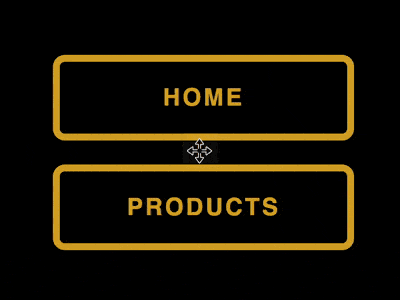

+++
title = '气泡填色按钮'
date = 2018-07-07T17:12:56+08:00
image = '/test-hugo-deploy/img/thumbs/072.png'
summary = '#72'
+++



## 效果预览

点击链接可以在 Codepen 预览。

[https://codepen.io/comehope/pen/eKqZjy](https://codepen.io/comehope/pen/eKqZjy)

## 可交互视频

此视频是可以交互的，你可以随时暂停视频，编辑视频中的代码。

[https://scrimba.com/p/pEgDAM/ceBEytp](https://scrimba.com/p/pEgDAM/ceBEytp)

## 源代码下载

每日前端实战系列的全部源代码请从 github 下载：

[https://github.com/comehope/front-end-daily-challenges](https://github.com/comehope/front-end-daily-challenges)

## 代码解读

定义 dom，用 `<nav>`, `<ul>` , `<li>` 构建导航结构，每个 `<li>` 中包含表示气泡的 4 个 `<span>`：
```html
<nav>
    <ul>
        <li>
            home
            <span></span><span></span><span></span><span></span>
        </li>
    </ul>
</nav>
```

居中显示：
```css
body {
    margin: 0;
    height: 100vh;
    display: flex;
    align-items: center;
    justify-content: center;
    background-color: black;
}
```

设置按钮样式：
```css
nav ul {
    list-style-type: none;
    margin: 0;
    padding: 0;
}

nav ul li {
    --c: goldenrod;
    color: var(--c);
    font-size: 16px;
    border: 0.3em solid var(--c);
    border-radius: 0.5em;
    width: 12em;
    height: 3em;
    text-transform: uppercase;
    font-weight: bold;
    font-family: sans-serif;
    letter-spacing: 0.1em;
    text-align: center;
    line-height: 3em;
}
```

在按钮下面画出气泡：
```css
nav ul li {
    position: relative;
}

nav ul li span {
    position: absolute;
    width: 25%;
    height: 100%;
    background-color: var(--c);
    transform: translateY(150%);
    border-radius: 50%;
}
```

把 4 个气泡并排摆放：
```css
nav ul li span {
    left: calc((var(--n) - 1) * 25%);
}

nav ul li span:nth-child(1) {
    --n: 1;
}

nav ul li span:nth-child(2) {
    --n: 2;
}

nav ul li span:nth-child(3) {
    --n: 3;
}

nav ul li span:nth-child(4) {
    --n: 4;
}
```

增加当鼠标悬停在按钮上时，4 个气泡依次出现的效果：
```css
nav ul li span {
    transition: 0.5s;
    transition-delay: calc((var(--n) - 1) * 0.1s);
}

nav ul li:hover span {
    transform: translateY(0) scale(2);
}
```

隐藏按钮外的内容，形成只在悬停时气泡才出现的效果：
```css
nav ul li {
    overflow: hidden;
}
```

把气泡放到下层，文字放到上层：
```css
nav ul li {
    z-index: 1;
    transition: 0.5s;
}

nav ul li span {
    z-index: -1;
}

nav ul li:hover {
    color: black;
}
```

在 dom 中再增加几个按钮：
```html
<nav>
    <ul>
        <li>
            home
            <span></span><span></span><span></span><span></span>
        </li>
        <li>
            products
            <span></span><span></span><span></span><span></span>
        </li>
        <li>
            services
            <span></span><span></span><span></span><span></span>
        </li>
        <li>
            contact
            <span></span><span></span><span></span><span></span>
        </li>
    </ul>
</nav>
```

最后，给按钮之间留出空隙：
```css
nav ul li {
    margin: 1em;
}
```

大功告成！
