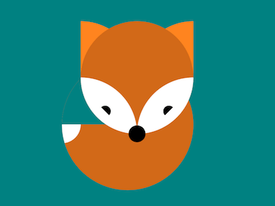

+++
title = '狐狸'
date = 2018-07-08T17:13:15+08:00
image = '/test-hugo-deploy/img/thumbs/073.png'
summary = '#73'
+++



## 效果预览

点击链接可以在 Codepen 预览。

[https://codepen.io/comehope/pen/OEKZed](https://codepen.io/comehope/pen/OEKZed)

## 可交互视频

此视频是可以交互的，你可以随时暂停视频，编辑视频中的代码。

[https://scrimba.com/p/pEgDAM/cvEm3uq](https://scrimba.com/p/pEgDAM/cvEm3uq)

## 源代码下载

每日前端实战系列的全部源代码请从 github 下载：

[https://github.com/comehope/front-end-daily-challenges](https://github.com/comehope/front-end-daily-challenges)

## 代码解读

定义 dom，容器中包含 2 个元素，即头和尾巴，`<head>` 再包含 4 个元素，表示脸颊、眼睛、耳朵和鼻子。
```html
<div class="fox">
    <div class="head">
        <span class="faces"></span>
        <span class="eyes"></span>
        <span class="ears"></span>
        <span class="nose"></span>
    </div>
    <div class="tail"></div>
</div>
```

居中显示：
```css
body {
	margin: 0;
	height: 100vh;
	display: flex;
	align-items: center;
	justify-content: center;
    --bc: teal;
    background-color: var(--bc);
}
```

定义容器尺寸：
```css
.fox {
	width: 7em;
    height: 9em;
    font-size: 30px;
}
```

画出圆形的头部轮廓：
```css
.fox {
    --c: chocolate;
    position: relative;
    color: var(--c);
}

.fox .head {
    position: absolute;
	width: 6em;
	height: 6em;
	background-color: currentColor;
	border-radius: 50%;
    right: 0;
}
```

画出叶片形的脸颊：
```css
.fox .faces::before,
.fox .faces::after {
    content: '';
    position: absolute;
    width: 3em;
    height: 3em;
    background-color: white;
    border-radius: 0 100% 0 100%;
    top: 3em;
}

.fox .faces::after {
    right: 0;
    transform: rotate(-90deg);
}
```

画出半圆形的眼睛：
```css
.fox .eyes::before,
.fox .eyes::after {
    content: '';
    position: absolute;
    border: 0.3em solid;
    border-color: black black transparent transparent;
    border-radius: 50%;
	top: 4.5em;
}

.fox .eyes::before {
	left: 1em;
}

.fox .eyes::after {
	right: 1em;
	transform: rotate(-90deg);
}
```

画出扇形的耳朵：
```css
.fox .ears::before,
.fox .ears::after {
    width: 3em;
    height: 3em;
    background-color: currentColor;
    filter: brightness(1.25);
    border-radius: 0 100% 0 0;
    z-index: -1;
}

.fox .ears::after {
	right: 0;
    transform: rotate(-90deg);
}
```

画出圆形的鼻子：
```css
.fox .nose{
    position: absolute;
    width: 1em;
    height: 1em;
    background-color: black;
    border-radius: 50%;
    top: calc(6em - 1em / 2);
    right: calc((6em - 1em) / 2);
    transform: scale(0.9);
}
```

画出圆形的尾巴：
```css
.fox .tail{
	width: 7em;
	height: 7em;
	background-color: currentColor;
    border-radius: 50%;
	position: absolute;
	z-index: -1;
    bottom: 0;
}
```

去掉尾巴左上角的扇形：
```css
.fox .tail::before {
    content: '';
    position: absolute;
    width: calc(7em / 2);
    height: calc(7em / 2);
    background-color: var(--bc);
    border-radius: 100% 0 0 0;
}
```

画出扇形的尾巴尖：
```css
.fox .tail{
    overflow: hidden;
}

.fox .tail::after {
    content: '';
    position: absolute;
    width: 1em;
    height: 1em;
    border-radius: 0 0 100% 0;
    background: white;
    bottom: calc(7em / 2 - 1em);
}
```

最后，增加鼠标悬停效果：
```css
.fox {
    transition: 1s;
}

.fox:hover {
    --c: lightblue;
}
```

大功告成！
